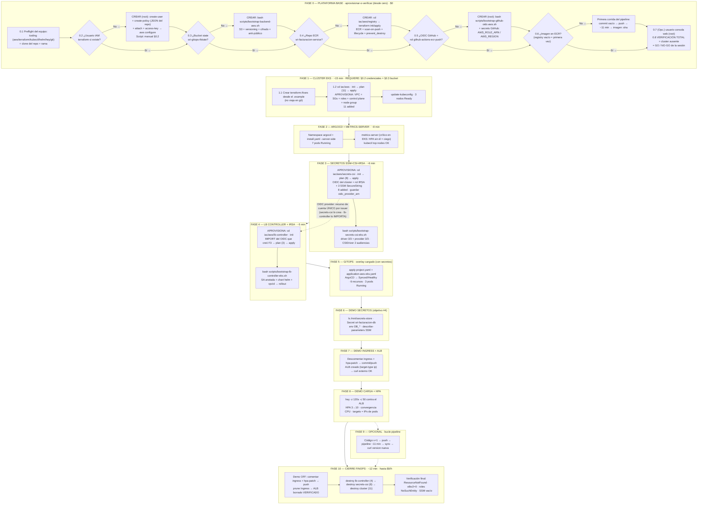

# DEMO_STACK_AWS_FINAL — Sesión completa del stack AWS (de cero a cero)

> **Ensayo total previo a la exposición — modo "desde cero absoluto" (apto para Dummies).**
> Este documento levanta **TODO el stack AWS** en orden estricto — **plataforma base** → clúster →
> ArgoCD/metrics → secretos SSM+CSI+IRSA → LB Controller → GitOps — e integra las **tres demos**
> (secretos, Ingress/ALB, pruebas de carga HPA) más el cierre FinOps a $0/h.
> **NO asume nada ya creado:** cada componente de plataforma (usuario IAM, bucket S3, ECR,
> OIDC GitHub, imagen en ECR) indica primero cómo **verificarlo** y, si no existe, cómo
> **aprovisionarlo** (FASE 0, ramas condicionales). Diseñado para ejecutarse **desde otro equipo**:
> incluye tooling, credenciales, rutas portables, el manejo del `terraform.tfvars` (no viaja en
> git — ver FASE 1) y todos los incidentes conocidos ya mitigados.

**Datos de la sesión**

| Parámetro | Valor |
|---|---|
| Cuenta AWS | `053044806920` (pay-as-you-go) |
| Región / Clúster | `us-east-1` / `sri-eks-cluster` |
| Rama del repo | `feature-patron-appOfapps` |
| Identidad de trabajo | usuario IAM `terraform-ci` (least-privilege, por diseño) |
| Duración estimada | ~50-70 min de levantamiento + ~30 min de demos + ~12 min de cierre |
| Costo | **$0.22/h** mientras el clúster vive → sesión completa ≈ **$0.8-1.2**; $0/h tras el cierre |
| Resultado | Stack completo operativo + evidencias (screenshots) + destroy total verificado |

**Reglas de oro (no negociables):**
1. El clúster es el **único reloj de facturación**: se destruye siempre al cierre.
2. El **Ingress (ALB) se desactiva ANTES** de destruir el clúster — un ALB huérfano factura de por vida.
3. La **plataforma base** (usuario `terraform-ci`, bucket de state, ECR, OIDC GitHub + rol de push)
   se **aprovisiona UNA sola vez** (FASE 0, solo si falta) y **sobrevive** a todos los ciclos
   destroy/apply del clúster. En sesiones siguientes: **solo se verifica**.
4. **Identidades:** `root` solo para el bootstrap humano puntual (usuario IAM, OIDC GitHub, usuario
   de consola — §0.2/§0.5/§0.7); `terraform-ci` para todo lo demás (Terraform, scripts, verificaciones).
5. Los scripts de bootstrap son **portables** (auto-detectan la raíz del repo) e **idempotentes**
   (reejecutarlos no hace daño: si el recurso existe, lo confirman).
6. El **`terraform.tfvars` está gitignored**: no viaja en el clon — se recrea en cada equipo nuevo
   desde `terraform.tfvars.example` (ver FASE 1, paso 1.1).
7. Este documento es AWS. La pata Azure (Key Vault) es otra sesión.

---

## 1. Diagrama de flujo — macro



**Mapa de dependencias (por qué este orden):**
- El **bucket de state (§0.3)** debe existir ANTES de cualquier `terraform init` — el backend `s3`
  de TODOS los módulos lo referencia → §0.3 antes de §0.4 y de F1.
- La **identidad (§0.2)** debe existir antes de todo: cada comando usa `terraform-ci`.
- El **ECR (§0.4) y el rol de push (§0.5)** deben existir ANTES del pipeline (primera imagen y F9).
- La **imagen del tag** que referencia el overlay debe existir ANTES del sync → §0.6 (solo cuenta
  nueva; en cuentas ya usadas el pipeline la creó en su momento).
- El **módulo secrets-csi** lee el OIDC del clúster vivo → después de F1.
- El **driver CSI** debe existir ANTES del sync de la Application (CRD `SecretProviderClass`) → F3 antes de F5.
- El **rol IRSA** de secretos debe existir antes del sync (el SA anotado lo referencia) → F3 antes de F5.
- El **módulo lb-controller** comparte el OIDC del clúster (único por issuer) → en F4 se **importa** el que creó F3.
- El **Ingress** debe morir antes que el clúster → F10 paso 1 antes de todo destroy.

---

## 2. Resumen ejecutivo de fases

| Fase | Qué se logra | Artefactos clave | Costo |
|---|---|---|---|
| 0 | Plataforma base **APROVISIONADA o verificada** (condicional, desde cero): `terraform-ci` · bucket · ECR · OIDC GitHub + rol · imagen | Scripts bootstrap + `iac/aws/registry` (solo si faltan) | $0 |
| 1 | Infraestructura efímera creada (control plane + 3 workers) | `iac/aws` apply → 11 recursos | **$0.22/h desde aquí** |
| 2 | GitOps ejecutable + HPA con métricas | ArgoCD 7 pods · metrics-server | $0 |
| 3 | Secretos nacidos en runtime (SSM) + identidad IRSA + driver | Módulo (8) + `bootstrap-secrets-csi-eks.sh` | $0 |
| 4 | Exposición externa lista (controller + rol IRSA) | Import OIDC + módulo (3) + `bootstrap-lb-controller-eks.sh` | $0 |
| 5 | App desplegada por GitOps **con secretos montados** | Application → Synced/Healthy | $0 |
| 6 | Evidencia del objetivo #4 (SSM → pod) | `exec` + Secret + SSM | $0 |
| 7 | ALB real sirviendo (target-type ip) | Ingress → ALB → curl | ALB ~$0.02/h mientras exista |
| 8 | Elasticidad demostrada (HPA) | `hey` + HPA + target-health | $0 |
| 9 | Bucle CI/CD completo (opcional) | Pipeline + ArgoCD auto-sync | $0 (Actions gratis) |
| 10 | Cuenta a $0/h sin huérfanos | Destroys ordenados + verificaciones | $0 |

---

## FASE 0 — Plataforma base: aprovisionar o verificar (desde cero)

**Qué se logra:** dejar lista la **plataforma base** de la cuenta — lo que vive FUERA del ciclo
create/destroy del clúster. **Desde aquí el reloj aún no corre ($0/h).**

**Filosofía "Dummies" — cada bloque hace 3 cosas:**
1. **IDENTIFICAR** qué es y por qué existe (en una línea).
2. **VERIFICAR** si ya está (comando de lectura).
3. **APROVISIONAR** solo si falta (comando/script), indicando la **identidad** correcta.

**Leyenda de identidades:**
- **ROOT** — bootstrap humano puntual, una sola vez por cuenta (consola web de root → CloudShell:
  así las credenciales root nunca tocan el equipo).
- **terraform-ci** — identidad de trabajo del día a día (Terraform, scripts, verificaciones).

---

### 0.1 Preflight del equipo (tooling + repo)

**IDENTIFICAR:** el equipo necesita las herramientas y el código. Nada que aprovisionar en AWS.

```bash
command -v aws terraform kubectl helm git
command -v hey || echo "FALTA hey"
command -v go  || echo "FALTA go (necesario para compilar hey)"
```

Instalación de lo que falte (macOS/Linux, sin sudo en lo posible):
- **helm v3** (si falta): tarball oficial `get.helm.sh` → binario a `/usr/local/bin`.
- **hey** (si falta): `go install github.com/rakyll/hey@latest` y agregar `$HOME/go/bin` al PATH
  (alternativa: `brew install hey`). `hey` NO tiene flag `-version`: se verifica con `command -v hey`.

```bash
git clone <URL_DEL_REPO> gitops-multicloud && cd gitops-multicloud
git checkout feature-patron-appOfapps && git pull
```

**Nota de portabilidad:** los scripts `scripts/bootstrap-*-eks.sh` auto-detectan la raíz del
repo (funcionan con cualquier ruta de clon). No hay que editar nada.

### 0.2 Identidad de trabajo `terraform-ci` (APROVISIONA si falta)

**IDENTIFICAR:** el usuario IAM least-privilege con el que corre TODA la sesión. Su política
versionada en `iac/aws/policies/terraform-ci-policy.json` es la **fuente de verdad** de permisos
(sin `List*` genéricos, sin `kms:Decrypt`, sin `ecr:DeleteRepository` — permisos por diseño).

```bash
# ---- VERIFICAR ----
aws sts get-caller-identity --query "Arn" --output text
# Esperado: arn:aws:iam::053044806920:user/terraform-ci
```

Si NO existe → **APROVISIONAR (identidad: ROOT — una sola vez por cuenta):**

```bash
# (ejecutar desde la consola web de root → CloudShell, con el repo ya clonado)
aws iam create-user --user-name terraform-ci

aws iam create-policy --policy-name terraform-ci-policy \
  --policy-document file://iac/aws/policies/terraform-ci-policy.json

aws iam attach-user-policy --user-name terraform-ci \
  --policy-arn arn:aws:iam::053044806920:policy/terraform-ci-policy

aws iam create-access-key --user-name terraform-ci
# ^ GUARDAR en lugar seguro (gestor de contraseñas). NUNCA en el repo ni en texto plano.
```

De vuelta en el equipo: `aws configure` con esa access key + region `us-east-1`.

### 0.3 Bucket de estado S3 (APROVISIONA si falta)

**IDENTIFICAR:** el backend remoto del state (`sri-gitops-tfstate`). **Sin él, ningún
`terraform init` funciona** — TODOS los módulos lo referencian. Locking nativo de S3
(`use_lockfile`, Terraform ≥ 1.10): no hay DynamoDB.

```bash
# ---- VERIFICAR ----
aws s3api head-bucket --bucket sri-gitops-tfstate && echo "bucket de state OK"
# Sin salida de error + "bucket de state OK" → existe. (404 → aprovisionar)
```

Si falta → **APROVISIONAR (identidad: terraform-ci — tiene `s3:CreateBucket`, versioning, cifrado
y public-block en su política):**

```bash
bash scripts/bootstrap-backend-aws.sh
# Idempotente. Crea: bucket + versioning + cifrado AES256 + bloqueo de acceso público.
# (solo aplicable a cuenta nueva; para otro nombre de bucket: export TF_STATE_BUCKET=...)
```

### 0.4 Registry ECR (APROVISIONA si falta)

**IDENTIFICAR:** el repo de imágenes del microservicio. Es **plataforma** (sobrevive a los
destroys del clúster): vive en su propio módulo con **state separado** (`aws/registry.tfstate`).

```bash
# ---- VERIFICAR ----
aws ecr describe-repositories --repository-names sri-facturacion-service \
  --query "repositories[0].repositoryUri" --output text
```

Si falta → **APROVISIONAR (identidad: terraform-ci — tiene `ecr:CreateRepository`):**

```bash
cd iac/aws/registry
terraform init          # Requiere: bucket de §0.3 vivo (backend s3)
terraform plan          # Esperado: 2 to add (repo + lifecycle policy)
terraform apply         # Esperado: 2 added
terraform output        # repository_url: 053044806920.dkr.ecr.us-east-1.amazonaws.com/sri-facturacion-service
cd ../../..
```

**Qué crea:** repo `MUTABLE` (para el puntero flotante `:latest`) + scan de vulnerabilidades en
cada push + cifrado AES256 + expiración de imágenes sin tag a 7 días + **`prevent_destroy`**
(capa 1: un `terraform destroy` accidental se bloquea; eliminarlo exige quitar el bloque en
código — commit deliberado).

### 0.5 OIDC GitHub + rol de push (APROVISIONA si falta)

**IDENTIFICAR:** la federación que permite a **GitHub Actions** autenticarse en AWS **sin claves
de larga vida** (OIDC → rol `github-actions-ecr-push`, trust solo a este repo y sus ramas,
policy de push a ECR scoped al repo — sin borrado). Es el motor de §0.6 y de la FASE 9.

```bash
# ---- VERIFICAR (least-privilege: sin List*; el OIDC se demuestra DESDE la trust del rol) ----
aws iam get-role --role-name github-actions-ecr-push --query "Role.Arn" --output text
aws iam get-role --role-name github-actions-ecr-push \
  --query "Role.AssumeRolePolicyDocument.Statement[0].Principal.Federated" --output text
# Esperado: arn:aws:iam::053044806920:oidc-provider/token.actions.githubusercontent.com
```

Si falta → **APROVISIONAR (identidad: ROOT — el script tiene guard que lo exige):**

```bash
bash scripts/bootstrap-github-oidc-aws.sh
# Idempotente. Crea: OIDC provider token.actions.githubusercontent.com + rol github-actions-ecr-push
# (trust con doble patrón de 'sub' — GitHub migró el claim a IDs inmutables) + policy inline de
# push a ECR scoped al repo. Al terminar IMPRIME las instrucciones de los secrets de GitHub.
# (si replicas en otra cuenta/repo: editar ACCOUNT_ID y GITHUB_REPO al inicio del script)
```

**Completar en GitHub** (Settings del repo `dacl010811/gitops-multicloud`):
- Secrets and variables → Actions → **`AWS_ROLE_ARN`** (el ARN que imprime el script) y **`AWS_REGION`** = `us-east-1`.
- Actions → General → Workflow permissions: **Read and write** (el pipeline hace push del bump de tag).

**No confundir:** este OIDC **de GitHub** es distinto del OIDC **del clúster EKS** que nace en
FASE 3 — dos issuers distintos, dos providers distintos, ambos conviven sin problema.

### 0.6 Primera imagen en ECR (APROVISIONA si el registry está vacío)

**IDENTIFICAR:** el overlay despliega el tag `:<sha>` referenciado en
`gitops/overlays/aws-eks/kustomization.yaml` — **si el ECR está vacío, FASE 5 termina en
`ImagePullBackOff`**. En cuentas ya usadas, el pipeline ya pobló el registry: solo verificar.

```bash
# ---- VERIFICAR ----
aws ecr list-images --repository-name sri-facturacion-service \
  --query "imageIds[].imageTag" --output text
# Con :latest y :<sha> listados → OK.
```

Si está vacío → **APROVISIONAR (disparar el pipeline UNA vez):**

```bash
git commit --allow-empty -m "ci: primera imagen (bootstrap del registry)"
git push
# Corre .github/workflows/ci-cd.yaml: pytest → build → push a ECR (~11 min)
# (alternativa sin commit: si el workflow tiene workflow_dispatch → gh workflow run ci-cd.yaml)
```

### 0.7 Usuario de consola web (OPCIONAL — aprovisiona si falta)

**IDENTIFICAR:** usuario humano `k8sweb-admin` para ver el clúster por consola; su acceso al
clúster es **declarativo** (access entry generada por Terraform desde `admin_principal_arns`
del tfvars — se recrea sola en FASE 1).

```bash
# ---- VERIFICAR ----
aws iam get-user --user-name k8sweb-admin --query "User.Arn" --output text
# (si da AccessDenied: es el least-privilege de terraform-ci — verifica entrando a la consola web)
```

Si falta → **APROVISIONAR (identidad: ROOT — el script tiene guard que lo exige):**

```bash
bash scripts/bootstrap-consolaweb-viewer-k8s.sh
```

### 0.8 Verificación total = GO / NO-GO de la sesión (todo $0)

```bash
aws sts get-caller-identity --query "Arn" --output text          # = terraform-ci

aws s3api head-bucket --bucket sri-gitops-tfstate && echo "bucket OK"

aws ecr describe-repositories --repository-names sri-facturacion-service \
  --query "repositories[0].repositoryUri" --output text          # URI del repo

aws iam get-role --role-name github-actions-ecr-push --query "Role.Arn" --output text
aws iam get-role --role-name github-actions-ecr-push \
  --query "Role.AssumeRolePolicyDocument.Statement[0].Principal.Federated" --output text

aws eks describe-cluster --name sri-eks-cluster --region us-east-1 2>&1 | head -2
# Esperado: ResourceNotFoundException (punto de partida limpio: el clúster NO existe;
# la plataforma base §0.2-§0.6 SÍ). Si algo falla arriba → regresa a su sub-sección.
```

**Nota least-privilege (para el jurado):** el OIDC de GitHub se demuestra DESDE la trust del rol —
`terraform-ci` no tiene `ListPolicies` ni `ListOpenIDConnectProviders` (auditoría genérica denegada
por diseño) y este método sí está permitido.

### 0.9 Atajo: sesiones con la plataforma ya poblada (caso del ensayo de mañana)

Si la cuenta ya se usó antes (bucket, `terraform-ci`, ECR, OIDC GitHub e imagen ya existen),
la FASE 0 se reduce a: **§0.1 (tooling + clone) + `aws configure` + §0.8 (verificaciones)**
(~5 min, $0). Las ramas "APROVISIONAR" solo se ejecutan en una **cuenta nueva desde cero**
(regla de oro #3).

---

## FASE 1 — Clúster EKS (~15 min)

**Qué se logra:** la infraestructura **efímera** (control plane + node group + red) creada por
Terraform. **Arranca el reloj: $0.22/h.**
**Requiere:** `terraform-ci` configurado (§0.2) + bucket de state vivo (§0.3).

### 1.1 Preparar el `terraform.tfvars` (¡no viaja en git!)

```bash
cd iac/aws
cp terraform.tfvars.example terraform.tfvars
```

Contenido para la cuenta real (Escenario A): `cluster_role_arn = ""` y `node_role_arn = ""`
(vacíos = Terraform crea los roles con su `iam:CreateRole`). Opcional:
`admin_principal_arns = ["arn:aws:iam::053044806920:user/k8sweb-admin"]` (access entry de la consola).

**⚠️ Mina desactivada:** el `terraform.tfvars` está en `.gitignore` — NO llega en el clon. En un
equipo nuevo hay que recrearlo (o copiarlo a mano del equipo anterior).

### 1.2 Terraform apply

```bash
terraform init      # Conecta al bucket de §0.3
terraform plan      # Esperado: 11 to add
terraform apply     # Esperado: 11 added (node group ~2 min)

aws eks update-kubeconfig --region us-east-1 --name sri-eks-cluster
kubectl get nodes   # Esperado: 3 nodos Ready (t3.medium)
cd ../..
```

**Incluye (para la narrativa):** access entries declarativas — `k8sweb-admin` (consola) se
recrea sola desde `admin_principal_arns` del tfvars, y el creador (`terraform-ci`) queda admin
vía `bootstrap_cluster_creator_admin_permissions = true`.

**Aquí NO se crea:** el ECR (§0.4) — es plataforma; el clúster solo lo **consume** vía el pipeline. Los módulos de F3 (secrets-csi) y F4 (lb-controller) se aprovisionan más adelante, **cuando el clúster ya existe** (necesitan su OIDC).

---

## FASE 2 — ArgoCD + metrics-server (~8 min)

**Qué se logra:** el ejecutor de GitOps (ArgoCD) y los "ojos" del HPA (metrics-server).
Sin metrics-server, el HPA queda ciego y ArgoCD lo reporta `Degraded` con pods sanos
(incidente didáctico del ensayo — ya conocido).

```bash
# ArgoCD (método oficial del proyecto: install.yaml, NO helm)
kubectl create namespace argocd --dry-run=client -o yaml | kubectl apply -f -
kubectl apply -n argocd -f https://raw.githubusercontent.com/argoproj/argo-cd/stable/manifests/install.yaml --server-side
# --server-side es obligatorio: el CRD applicationsets supera los 256KB del last-applied
kubectl get pods -n argocd -w      # Esperado: 7 pods Running (~3 min)

# metrics-server (EKS NO lo trae de fábrica, a diferencia de AKS)
kubectl apply -f https://github.com/kubernetes-sigs/metrics-server/releases/latest/download/components.yaml
kubectl top nodes                  # Esperado (~1 min): 3 nodos con CPU/mem
```

---

## FASE 3 — Secretos SSM + CSI + IRSA (~6 min)

**Qué se logra:** las credenciales **nacen en runtime** (una `random_password` de Terraform
aterriza como `SecureString` en SSM), existe la identidad IRSA que las lee, y el clúster tiene
el contrato (CRD) + traductor (provider AWS) para montarlas.
**Requiere:** FASE 1 (clúster vivo — el módulo lee su OIDC) + helm (§0.1).
**APROVISIONA:** el **OIDC provider del clúster** (recurso de cuenta único por issuer — FASE 4 lo
adoptará con `import`) + rol IRSA + 3 parámetros SSM. Todo muere en el cierre (FASE 10).

### 3A. Módulo Terraform (crea rol IRSA + 3 parámetros SSM + OIDC)

```bash
cd iac/aws/secrets-csi
terraform init
terraform plan      # Esperado: 8 to add (OIDC provider + rol + policy + attachment
                    #                     + 3 SSM SecureString + random_password)
terraform apply     # Esperado: 8 added
terraform output secrets_csi_role_arn
terraform output oidc_provider_arn     # ANOTAR: lo usa la FASE 4 (import)
cd ../../..
```

### 3B. Driver CSI + provider AWS (script)

```bash
bash scripts/bootstrap-secrets-csi-eks.sh
```

**Qué hace:** guards (cluster alcanzable, helm instalado, rol IRSA leído del state) → repo helm
`kubernetes-sigs` (subpath `/charts/`) → chart `secrets-store-csi-driver` v1.4.8 pineado
(syncSecret + tokenRequests con doble audiencia) → PASO 2b: anota el SA del chart (fallback
legacy) → provider AWS (DaemonSet) → espera rollouts.

**Esperado:** driver `3/3 Running` + provider `1/1 Running` por nodo; CSIDriver
`secrets-store.csi.k8s.io` con `TOKENREQUESTS: sts.amazonaws.com,pods.eks.amazonaws.com`;
`PluginRegistered:true` en cada nodo.

---

## FASE 4 — LB Controller + IRSA (~5 min) — incluye el IMPORT del OIDC

**Qué se logra:** rol IRSA del controller + el propio controller corriendo en el clúster,
listos para materializar el ALB cuando el Ingress se active (FASE 7).
**Requiere:** FASE 3 (el OIDC que se importa nace ahí) + helm (§0.1).
**APROVISIONA:** rol IRSA del ALB + policy oficial + attachment (el controller en sí lo instala
el script vía helm).

**CRÍTICO — el paso del `import`:** solo puede existir **un OIDC provider por issuer URL** en la
cuenta, y el módulo `secrets-csi` (FASE 3) ya creó el del clúster. El módulo `lb-controller`
declara ese mismo recurso, así que hay que **adoptarlo** — sin el import, el apply fallaría con
`EntityAlreadyExists`.

```bash
cd iac/aws/lb-controller
terraform init

OIDC_ARN=$(terraform -chdir=../secrets-csi output -raw oidc_provider_arn)
terraform import aws_iam_openid_connect_provider.eks "$OIDC_ARN"

terraform plan      # Esperado: 3 to add (rol alb-controller + policy oficial + attachment)
terraform apply     # Esperado: 3 added
cd ../../..

bash scripts/bootstrap-lb-controller-eks.sh
```

**Qué hace el script:** guards (cluster alcanzable, helm, rol IRSA en el state) → crea y anota
la SA `kube-system/aws-load-balancer-controller` con el ARN del rol → helm repo `eks-charts` →
`helm upgrade --install` (idempotente) con **`vpcId` explícito** (sin él el controller intenta
IMDS y entra en CrashLoopBackOff) → rollout status.

**Esperado:** SA anotada + controller `Running` (deployment disponible).

---

## FASE 5 — GitOps: la aplicación con secretos (~3 min)

**Qué se logra:** ArgoCD lee el overlay `aws-eks` **"cargado"** (SPC + SA dedicada + parche de
secretos ACTIVOS en Git; ingress y hpa-patch comentados) y la app nace CON el volumen CSI.

```bash
kubectl apply -n argocd -f gitops/argocd/project.yaml
kubectl apply -n argocd -f gitops/argocd/application-aws-eks.yaml
kubectl -n argocd get applications -w     # Esperado: Synced/Healthy (~2-3 min)
kubectl -n sri-facturacion get pods       # Esperado: 3/3 Running
```

**Nota:** los pods pasan unos segundos en `ContainerCreating` mientras el driver monta los
parámetros SSM — es el comportamiento correcto (el pod arranca con el secreto dentro).

---

## FASE 6 — DEMO: secretos (objetivo #4)

**Qué se logra:** la evidencia física de la cadena completa `SSM → CSI → Secret nativo → env`.

```bash
# 1. El montaje directo (parámetros SSM como archivos)
kubectl -n sri-facturacion exec deploy/sri-facturacion-service-deployment -- ls -l /mnt/secrets-store/
# Esperado: DB_HOST  DB_PASSWORD  DB_USER

# 2. El Secret nativo que sincronizó el driver (alimenta el envFrom)
kubectl -n sri-facturacion get secret sri-facturacion-db

# 3. La cadena hasta el proceso
kubectl -n sri-facturacion exec deploy/sri-facturacion-service-deployment -- env | grep DB_
# (para la demo sin mostrar el password: ... env | grep -E 'DB_(USER|HOST)')

# 4. La fuente de verdad (SSM, SecureString)
aws ssm describe-parameters --parameter-filters "Key=Name,Option=BeginsWith,Values=/sri-facturacion" \
  --query "Parameters[].[Name,Type]" --output table

# 5. La app respondiendo
kubectl -n sri-facturacion port-forward svc/sri-facturacion-service 5000:5000
# otra terminal: curl -s localhost:5000/api/v1/version; echo
```

**Screenshot para el TFM:** árbol de la Application en la UI de ArgoCD
(port-forward 127.0.0.1:8082) — se ve el Secret `sri-facturacion-db` como relación del árbol.

**Dato de oro para el jurado:** `terraform-ci` NO puede leer el valor descifrado (least-privilege:
no tiene `kms:Decrypt`); el único camino al texto claro es la identidad del pod vía IRSA.

---

## FASE 7 — DEMO: Ingress + ALB (demo mode ON)

**Qué se logra:** ALB real sirviendo la app hacia Internet (target-type ip: balancea directo a pods).

**7.1 Activar el modo demo (un solo commit):** en `gitops/overlays/aws-eks/kustomization.yaml`
descomentar **dos** líneas: `- ingress.yaml` (resources) y el patch `hpa-patch.yaml` (umbral
didáctico 5% para la FASE 8). Commit + push.

```bash
kubectl -n argocd annotate application sri-facturacion-aws-eks argocd.argoproj.io/refresh=hard --overwrite
kubectl -n sri-facturacion get ingress -w      # Esperado: ADDRESS aparece (~2-3 min)
```

**7.2 La app por Internet:**

```bash
ALB=$(kubectl -n sri-facturacion get ingress sri-facturacion-ingress \
  -o jsonpath='{.status.loadBalancer.ingress[0].hostname}')
echo "$ALB"
curl -s -H "Host: api.sri.ec.gob.ec" "http://$ALB/health"; echo
curl -s -H "Host: api.sri.ec.gob.ec" "http://$ALB/api/v1/version"; echo
```

**Costo:** el ALB factura ~$0.02/h + LCU mientras exista → minutos de demo = centavos.
**Nunca se deja vivo:** el cierre (FASE 10) lo desactiva primero.

---

## FASE 8 — DEMO: pruebas de carga + HPA

**Qué se logra:** elasticidad demostrada con carga real contra el ALB; el HPA escala
3→10 y el target group registra las IPs de los pods nuevos automáticamente.

```bash
# Terminal 1 — la carga (120s, 50 workers, contra el ALB)
hey -z 120s -c 50 -H "Host: api.sri.ec.gob.ec" "http://$ALB/health"

# Terminal 2 — la escena
kubectl -n sri-facturacion get hpa -w
kubectl -n sri-facturacion get pods -w
# Esperado: réplicas 3→10, utilización por pod convergiendo hacia el 5% (umbral didáctico)
```

**Evidencia AWS (targets = IPs de pods, la joya del target-type ip):**

```bash
TG=$(aws elbv2 describe-target-groups --query "TargetGroups[0].TargetGroupArn" --output text)
aws elbv2 describe-target-health --target-group-arn "$TG" \
  --query "TargetHealthDescriptions[].{IP:Target.Id,State:TargetHealth.State}" --output table
# Esperado: N targets healthy con IPs 172.31.x.x (pods, no nodos)
```

**Nota didáctica:** el umbral 5% es deliberado (la app es `async` y barata en CPU): permite
demostrar la convergencia del HPA con carga modesta. Se revierte en el cierre.

---

## FASE 9 — OPCIONAL: bucle completo del pipeline (~11 min)

**Qué se logra:** el cierre triunfal opcional — un cambio de código recorre
`push → pytest → build/push ECR → bump de manifiesto [skip ci] → auto-sync → curl` sin kubectl.

```bash
# 1. Editar app/main.py: version "2.0.0" → "3.0.0"
# 2. commit + push → el pipeline corre (~11 min, <15 objetivo)
# 3. Cuando ArgoCD sincronice (nuevo ReplicaSet), verificar:
curl -s -H "Host: api.sri.ec.gob.ec" "http://$ALB/api/v1/version"; echo
# Esperado: {"version":"3.0.0","cloud":"aws","cluster":"sri-eks-cluster",...}
```

Referencia completa: `DEMO_AWS_GITOPS_JURADO.md` FASE 6 y `GITOPS V2-AWS.md`.

---

## FASE 10 — CIERRE FINOPS (orden estricto → $0/h)

**Qué se logra:** cuenta limpia sin huérfanos y facturación detenida. El orden respeta las
dependencias causales — **no cambiar el orden**.

**10.1 Demo mode OFF (el Ingress muere ANTES que el clúster — regla de oro #2):**
en `gitops/overlays/aws-eks/kustomization.yaml` volver a **comentar** `ingress.yaml` y
`hpa-patch.yaml` → commit + push → refresh:

```bash
kubectl -n argocd annotate application sri-facturacion-aws-eks argocd.argoproj.io/refresh=hard --overwrite
kubectl -n sri-facturacion get ingress        # Esperado: No resources found (prune de ArgoCD)
aws elbv2 describe-load-balancers --output text | wc -l    # Esperado: 0 (el controller borró el ALB)
```

**10.2 Destroy de módulos y clúster (orden inverso al de creación):**

```bash
# a) LB Controller (4 recursos: rol + policy + attachment + OIDC importado)
cd iac/aws/lb-controller
terraform destroy        # Esperado: 4 destroyed

# b) Secretos (8 recursos; si el OIDC ya murió con el destroy anterior,
#    Terraform lo tolera como "borrado externamente" y continúa)
cd ../secrets-csi
terraform destroy        # Esperado: 8 destroyed

# c) Clúster (11 recursos; ~4 min)
cd ..
terraform destroy        # Esperado: 11 destroyed
cd ../..
```

**10.3 Verificación final ($0/h):**

```bash
aws eks describe-cluster --name sri-eks-cluster --region us-east-1 2>&1 | head -2   # ResourceNotFound
aws elbv2 describe-load-balancers --output text | wc -l                            # 0
aws iam get-role --role-name sri-eks-cluster-secrets-csi 2>&1 | head -2            # NoSuchEntity
aws iam get-role --role-name sri-eks-cluster-alb-controller 2>&1 | head -2         # NoSuchEntity
aws ssm describe-parameters --parameter-filters "Key=Name,Option=BeginsWith,Values=/sri-facturacion" \
  --query "Parameters[].Name" --output text                                        # vacío
```

**Plataforma base que sobrevive** (NO se toca en el cierre; verificar en §0.8 del próximo
arranque): usuario `terraform-ci`, bucket `sri-gitops-tfstate`, ECR `sri-facturacion-service`,
OIDC GitHub + rol `github-actions-ecr-push` e imágenes del pipeline.

---

## Apéndice A — Incidentes conocidos y su mitigación (todos ya incorporados)

| Síntoma | Causa raíz | Mitigación en este flujo |
|---|---|---|
| Pods en `ContainerCreating` + "no matches for kind SecretProviderClass" | La CRD no existía: Application sincronizada sin driver | FASE 3 (driver) SIEMPRE antes de FASE 5 |
| "Failed to fetch parameters from all regions" | El pod usaba el SA `default` sin anotación IRSA (el provider lee la anotación del **SA del pod**) | SA dedicado `sri-facturacion-sa` + `serviceAccountName` (ya en el overlay) |
| Volumen pide un driver inexistente | `secrets-store.csi.x-k8s.io` (grupo API del CRD) ≠ `secrets-store.csi.k8s.io` (nombre del driver) | Overlays ya corregidos + validación en FASE 3B |
| `EntityAlreadyExists` al aplicar lb-controller | El OIDC del clúster ya lo creó secrets-csi (único por issuer) | **`terraform import` en FASE 4** |
| ArgoCD `Degraded` con pods sanos | HPA ciego (sin `metrics.k8s.io`) | metrics-server ANTES (FASE 2) |
| ALB huérfano facturando eternamente | Clúster destruido con Ingress vivo | Demo OFF verificado ANTES de los destroys (FASE 10.1) |
| `helm repo add` del driver da 404 | El repo Pages migró al subpath `/charts/` | URL corregida + `--force-update` (script) |
| Apply de ArgoCD falla por CRD grande | CRD `applicationsets` > 256KB del last-applied | `--server-side` (FASE 2) |
| `AccessDenied` en comandos de "auditoría" | `terraform-ci` es least-privilege (no tiene `List*` genéricos) | Comandos de verificación adaptados (trust del rol / ARN explícito) |
| `terraform init` falla (backend `s3`) | El bucket de state no existe (cuenta nueva) | **§0.3 lo aprovisiona PRIMERO** — todos los módulos dependen de él |
| El pipeline falla al asumir el rol | Secrets `AWS_ROLE_ARN`/`AWS_REGION` ausentes o Workflow permissions en "Read" | §0.5 los configura (el script imprime las instrucciones exactas) |
| `ImagePullBackOff` en FASE 5 | ECR vacío: el pipeline nunca corrió en esta cuenta | §0.6 dispara la primera corrida (~11 min) |
| Apply de `iac/aws` falla o no encuentra roles | `terraform.tfvars` ausente (gitignored: no viaja en el clon) | **Paso 1.1 lo recrea desde `.tfvars.example`** |

## Apéndice B — Mapa de scripts bootstrap (qué aprovisionan y dónde van en el flujo)

| Script | Qué APROVISIONA | Frecuencia | Identidad | Dónde en este flujo |
|---|---|---|---|---|
| `bootstrap-backend-aws.sh` | Bucket S3 de state (+versioning, cifrado, anti-público) | 1x por cuenta | terraform-ci o root | **§0.3 si falta el bucket** (idempotente) |
| `bootstrap-github-oidc-aws.sh` | OIDC de GitHub + rol `github-actions-ecr-push` + policy de push | 1x por cuenta (reejecutable para rotar) | **ROOT** (guard propio) | **§0.5 si falta** |
| `bootstrap-consolaweb-viewer-k8s.sh` | Usuario de consola `k8sweb-admin` + policy | 1x por cuenta | **ROOT** (guard propio) | §0.7 (opcional) |
| `bootstrap-secrets-csi-eks.sh` | Driver CSI + provider AWS (en el clúster) | Cada recreación | terraform-ci | **FASE 3B (siempre)** |
| `bootstrap-lb-controller-eks.sh` | Controller ALB (en el clúster) | Cada recreación | terraform-ci | **FASE 4B (siempre)** |
| `bootstrap-acr-rbac-azure.sh` | Pata Azure (ACR + RBAC) | — | az login | Fuera de alcance (otra sesión) |

**Notas:**
- El **ECR NO tiene script**: se aprovisiona con Terraform (`iac/aws/registry`, §0.4) — state separado que sobrevive a los destroys.
- El **usuario `terraform-ci` tampoco tiene script**: comandos IAM directos en §0.2 (identidad ROOT).
- Todos los scripts son **idempotentes**; los `-eks.sh` y el de consola son **portables** (auto-detectan la raíz del repo).

## Apéndice C — Costos de la sesión

| Recurso | Costo | Nota |
|---|---|---|
| Clúster EKS (control plane + 3× t3.medium) | **$0.22/h** | El único reloj: vive F1→F10 |
| ALB (solo F7-F8 + purge en F10) | ~$0.02/h + LCU | Minutos de demo = centavos |
| SSM Parameter Store (3 SecureString standard) | $0 | Sin cargos recurrentes |
| IAM (OIDC, roles, policies) | $0 | — |
| Secrets Store CSI Driver / LB Controller | $0 | Corren sobre los nodos existentes |
| Bucket S3 de state | ~$0.01/mes | Plataforma base — fuera del ciclo destroy |
| ECR + GitHub Actions | ~$0.01/mes | Plataforma base; repo público (Actions gratis); imágenes ~250 MB |
| **Total estimado de la sesión** | **≈ $0.8-1.2** | Y **$0/h** tras la FASE 10 |
