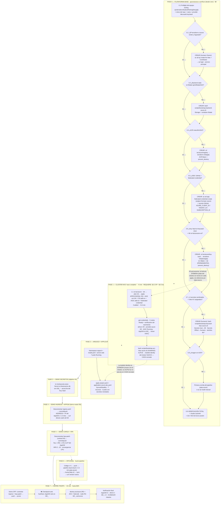

# DEMO_STACK_AZURE_FINAL — Sesión completa del stack Azure (de cero a cero)

> **Ensayo total previo a la exposición — modo "desde cero absoluto" (apto para Dummies).**
> Este documento levanta **TODO el stack Azure** en orden estricto — **plataforma base** → clúster AKS →
> ArgoCD → secretos Key Vault + CSI + Workload Identity → Ingress AGIC + Application Gateway → GitOps —
> e integra las **tres demos** (secretos, Ingress/AppGW, pruebas de carga HPA) más el cierre FinOps a $0/h.
> **NO asume nada ya creado:** cada componente de plataforma (Service Principal, backend de state, ACR,
> OIDC GitHub, Key Vault + Managed Identity, imagen en ACR) indica primero cómo **verificarlo** y, si no
> existe, cómo **aprovisionarlo** (FASE 0, ramas condicionales). Es el **gemelo Azure** de
> [DEMO_STACK_AWS_FINAL.md](DEMO_STACK_AWS_FINAL.md): mismo patrón, mismo orden de lectura, nube distinta.
>
> **Fuentes de esta sesión (ejecutada en vivo 2026-10-08):** plan de sesión
> [AZURESecretsKeyVault-CSI-AGIC.md](AZURESecretsKeyVault-CSI-AGIC.md) (FASES 0-8 ejecutadas y verificadas),
> [DEMO_AZURE_GITOPS_JURADO.md](investigaciones/DEMO_AZURE_GITOPS_JURADO.md) (ensayo de cero a cero del
> 2026-10-01/02) y [docs/RUNBOOK-IaC-Validacion.md](docs/RUNBOOK-IaC-Validacion.md).

**Datos de la sesión**

| Parámetro | Valor |
|---|---|
| Tenant Entra ID | `0fc1436e-05f9-416b-9d88-a108f4a1133b` |
| Suscripción | la del SP `terraform-ci-azure` (pay-as-you-go) — verificar con `az account show` |
| Región / Clúster | `eastus` / `sri-aks-cluster` (RG `sri-aks-rg`) |
| Rama del repo | `feature-patron-appOfapps` |
| Identidades de trabajo | **Humano (Owner)** para el bootstrap RBAC del Key Vault y del ACR · **SP `terraform-ci-azure`** (least-privilege) para todo lo demás |
| Duración estimada | ~50-70 min de levantamiento + ~30 min de demos + ~15 min de cierre |
| Costo | **$0.17-0.25/h** mientras el clúster + AppGW viven → sesión completa ≈ **$0.8-1.2**; $0/h tras el cierre |
| Resultado | Stack completo operativo + evidencias (screenshots) + destroy total verificado |

**Reglas de oro (no negociables):**
1. El **clúster + AppGW** son el **único reloj de facturación**: viven y mueren juntos; se destruyen al cierre. El AppGW factura **desde que nace el clúster** (~$0.02-0.05/h), no desde que se activa el Ingress.
2. **NO existe huérfano de balanceador por diseño:** el Application Gateway vive en el node RG `MC_*` (gestionado por AKS) y muere con el clúster. El apagado del Ingress al cierre es **ritual simétrico** (deja el repo en su punto de partida canónico), no un rescate anti-facturación — **diferencia consciente con AWS**, donde el ALB huérfano era el riesgo #1 de la sesión.
3. La **plataforma base** (SP `terraform-ci-azure`, backend de state, ACR, OIDC GitHub + federación, **Key Vault + Managed Identity + secretos**) se **aprovisiona UNA sola vez** (FASE 0, solo si falta) y **sobrevive** a todos los ciclos destroy/apply del clúster. En sesiones siguientes: **solo se verifica**.
4. **Identidades:** el **humano (Owner)** solo interviene en el bootstrap privilegiado puntual (role assignments del Key Vault/ACR, siembra de secretos — §0.7); el **SP `terraform-ci-azure`** opera todo lo demás (Terraform, pipeline, verificaciones). *"El humano gobierna una vez; las máquinas operan siempre."* El SP Contributor **no puede** crear role assignments ni escribir secretos en un KV RBAC — least privilege por diseño.
5. Los scripts de bootstrap son **portables** (auto-detectan la raíz del repo) e **idempotentes** (reejecutarlos no hace daño: si el recurso existe, lo confirman).
6. **El Key Vault es PERMANENTE, no efímero** (a diferencia del módulo de secretos de AWS): nombre único global + soft-delete de 90 días + costo residual ~$0.10/mes por los 3 secretos. La frontera permanente/efímero **se adapta al servicio**; el patrón de consumo (SPC + SA + identidad federada + volumen montado) es idéntico.
7. Este documento es Azure. La pata AWS es [DEMO_STACK_AWS_FINAL.md](DEMO_STACK_AWS_FINAL.md).

---

## 1. Diagrama de flujo — macro



**Mapa de dependencias (por qué este orden):**
- El **backend de state (§0.3)** debe existir ANTES de cualquier `terraform init` — los tres states
  (`azure/terraform.tfstate`, `azure/key-vault.tfstate`, `azure/registry.tfstate`) lo referencian → §0.3 antes de §0.4, §0.6 y F1.
- La **identidad (§0.2)** debe existir antes de todo: cada comando usa `terraform-ci-azure`.
- El **ACR (§0.4)** y la **federación de GitHub (§0.5)** deben existir ANTES del pipeline (§0.8 y F6).
- El **Key Vault + MI (§0.6)** deben existir ANTES del `terraform apply` del clúster: la **federated credential**
  (F1) referencia la MI por data source (dirección segura: lo efímero lee lo permanente).
- Los **3 secretos (§0.7)** deben existir ANTES de que la app monte el volumen (F2) — el pod nace con el secreto dentro.
- La **imagen del tag** que referencia el overlay debe existir ANTES del sync → §0.8.
- El **AcrPull de la kubelet identity** (F1, paso B3) debe existir ANTES del sync de la Application (F2),
  o los pods quedan en `ImagePullBackOff` con 401 (incidente real 2026-10-08 — la identity es nueva en cada recreate).
- El **AppGW + AGIC** nacen CON el clúster (F1) y configuran el Ingress cuando exista (F4) — a diferencia de AWS, no hay que instalar ningún controller.
- El **Ingress se apaga antes del destroy** (F7 paso 1) por **simetría y orden**, no por rescate: en Azure no puede quedar huérfano.

---

## 2. Resumen ejecutivo de fases

| Fase | Qué se logra | Artefactos clave | Costo |
|---|---|---|---|
| 0 | Plataforma base **APROVISIONADA o verificada** (condicional, desde cero): SP · backend · ACR · OIDC GitHub · **KV + MI + secretos** · imagen | Scripts bootstrap (3) + `iac/azure/{registry,key-vault}` (solo si faltan) | $0 (KV ~$0.10/mes permanente) |
| 1 | Infraestructura efímera "nacida completa" (clúster + WI + CSI + AGIC + AppGW + fedcred) + AcrPull | `iac/azure` apply → 3 recursos + script ACR RBAC | **$0.17-0.25/h desde aquí** |
| 2 | App desplegada por GitOps **con secretos montados** | ArgoCD 7 pods · Application → Synced/Healthy | $0 |
| 3 | Evidencia del objetivo #4 (Key Vault → pod) | `exec` + Secret + KV | $0 |
| 4 | AppGW real sirviendo hacia Internet (catch-all: IP directa) | Ingress → AGIC → IP → curl/browser | $0 incremental (AppGW ya factura desde F1) |
| 5 | Elasticidad demostrada (HPA) | `hey` + HPA 3→10 | ~$0.02 (carga) |
| 6 | Bucle CI/CD completo (opcional) | Pipeline dual-cloud + ArgoCD auto-sync | $0 (Actions gratis) |
| 7 | Suscripción a $0/h sin residuos efímeros | Destroy único + checkpoint + verificaciones | $0 |

**Equivalencia con el plan de sesión** (AZURESecretsKeyVault-CSI-AGIC.md): su FASE 0 (punto de partida)
≡ §0.9 de aquí · FASE 1 (módulo KV) ≡ §0.6-0.7 · FASE 2 (clúster) ≡ FASE 1 · FASE 3 (bootstrap) ≡ §0.7 ·
FASE 4 (ArgoCD) ≡ FASE 2 · FASE 5 (secretos) ≡ FASE 2-3 · FASE 6 (ingress) ≡ FASE 4 · FASE 7 (HPA) ≡ FASE 5 ·
FASE 8 (cierre) ≡ FASE 7. La diferencia de numeración es **la filosofía "plataforma primero"** de este
documento: todo lo permanente se verifica/aprovisiona en FASE 0.

---

## FASE 0 — Plataforma base: aprovisionar o verificar (desde cero)

**Qué se logra:** dejar lista la **plataforma base** de la suscripción — lo que vive FUERA del ciclo
create/destroy del clúster. **Desde aquí el reloj aún no corre ($0/h).**

**Filosofía "Dummies" — cada bloque hace 3 cosas:**
1. **IDENTIFICAR** qué es y por qué existe (en una línea).
2. **VERIFICAR** si ya está (comando de lectura).
3. **APROVISIONAR** solo si falta (comando/script), indicando la **identidad** correcta.

**Leyenda de identidades:**
- **HUMANO (Owner)** — bootstrap privilegiado puntual, una sola vez por suscripción/tenant (role
  assignments del ACR y del Key Vault, siembra de secretos, federación de GitHub).
- **SP `terraform-ci-azure`** — identidad de trabajo del día a día (Terraform, verificaciones).
  Contributor **no puede** crear role assignments ni escribir secretos en un KV RBAC: esa es la frontera
  de least privilege, no un obstáculo.

---

### 0.1 Preflight del equipo (tooling + repo + provider)

**IDENTIFICAR:** el equipo necesita las herramientas y el código. Nada que aprovisionar en Azure (salvo
el registro del provider, idempotente y $0).

```bash
command -v az terraform kubectl helm jq git
command -v hey || echo "FALTA hey"
```

Instalación de lo que falte (macOS/Linux, sin sudo en lo posible):
- **hey** (si falta): `go install github.com/rakyll/hey@latest` y agregar `$HOME/go/bin` al PATH
  (alternativa: `brew install hey`). `hey` NO tiene flag `-version`: se verifica con `command -v hey`.

```bash
git clone <URL_DEL_REPO> gitops-multicloud && cd gitops-multicloud
git checkout feature-patron-appOfapps && git pull

# Provider del Key Vault (no está entre los registrados por defecto; idempotente, $0)
az provider register --namespace Microsoft.KeyVault
az provider show --namespace "Microsoft.KeyVault" --query registrationState -o tsv   # → Registered
```

**Nota de portabilidad:** los scripts `scripts/bootstrap-*-azure.sh` y `bootstrap-keyvault-rbac-azure.sh`
auto-detectan la raíz del repo. No hay que editar rutas.

### 0.2 Identidad de trabajo SP `terraform-ci-azure` (APROVISIONA si falta)

**IDENTIFICAR:** el Service Principal least-privilege con el que corre TODA la sesión (Terraform y
verificaciones). Contributor sobre la suscripción — **sin** `Microsoft.Authorization/roleAssignments/write`
(por eso el RBAC lo hace el humano, regla de oro #4).

```bash
# ---- VERIFICAR ----
az account show --query "{sub:name, tenant:tenantId, user:user.name, type:user.type}" -o table
# Esperado: la suscripción real + user = APP_ID del SP + type = servicePrincipal
```

Si NO existe → **APROVISIONAR (identidad: HUMANO Owner — una sola vez por suscripción):**

```bash
az ad sp create-for-rbac --name "terraform-ci-azure" \
  --role Contributor --scopes /subscriptions/<SUBSCRIPTION_ID> --output json
# ^ GUARDAR appId/tenant/password en lugar seguro. NUNCA en el repo ni en texto plano.
```

De vuelta en el equipo: login con el SP (o equivalentes `ARM_*` / variables de entorno en CI):

```bash
az login --service-principal -u <APP_ID> -p <PASSWORD> --tenant 0fc1436e-05f9-416b-9d88-a108f4a1133b
# Terraform azurerm consume: ARM_CLIENT_ID / ARM_CLIENT_SECRET / ARM_TENANT_ID / ARM_SUBSCRIPTION_ID
```

### 0.3 Backend remoto de estado (APROVISIONA si falta)

**IDENTIFICAR:** el backend del state (`sri-tfstate-rg` + Storage Account `sritfstate23c5` + container
`tfstate`). **Sin él, ningún `terraform init` funciona** — los tres states Azure lo referencian. Es
también la "casa de la plataforma": en el mismo RG viven el ACR y el Key Vault.

```bash
# ---- VERIFICAR ----
az group show -n sri-tfstate-rg --query name -o tsv                    # → sri-tfstate-rg
az storage account show -n sritfstate23c5 -g sri-tfstate-rg --query name -o tsv
```

Si falta → **APROVISIONAR (identidad: SP terraform-ci-azure):**

```bash
bash scripts/bootstrap-backend-azure.sh
# Idempotente. Crea: RG sri-tfstate-rg + Storage Account + container 'tfstate'.
# (solo aplicable a suscripción nueva; el nombre del Storage Account es ÚNICO GLOBAL)
```

### 0.4 Registry ACR (APROVISIONA si falta)

**IDENTIFICAR:** el registro de imágenes del microservicio (`sriacrtfm23c5`, Login Server
`sriacrtfm23c5.azurecr.io`). Es **plataforma** (sobrevive a los destroys del clúster): vive en su propio
módulo con **state separado** (`azure/registry.tfstate`).

```bash
# ---- VERIFICAR ----
az acr show -n sriacrtfm23c5 --query "{name:name, loginServer:loginServer, sku:sku.name}" -o table
```

Si falta → **APROVISIONAR (identidad: SP terraform-ci-azure):**

```bash
cd iac/azure/registry
terraform init          # Requiere: backend de §0.3 vivo
terraform plan          # Esperado: 2 to add
terraform apply         # Esperado: 2 added
terraform output        # login server: sriacrtfm23c5.azurecr.io
cd ../../..
```

**Qué crea:** ACR Basic + **`prevent_destroy`** (un `destroy` accidental se bloquea; eliminarlo exige
quitar el bloque en código — commit deliberado). Nota: el **AcrPush del SP del pipeline** y el
**AcrPull de la kubelet identity** NO son Terraform — los asigna el humano con
`scripts/bootstrap-acr-rbac-azure.sh` (el AcrPull se re-ejecuta en CADA recreate del clúster — FASE 1).

### 0.5 OIDC GitHub → Azure (APROVISIONA si falta)

**IDENTIFICAR:** la federación que permite a **GitHub Actions** autenticarse en Azure **sin claves de
larga vida** (federated credential sobre la App registration del SP del pipeline + secrets de GitHub).
Es el motor de §0.8 y de la FASE 6. Homólogo del OIDC de GitHub de la pata AWS.

```bash
# ---- VERIFICAR ----
az ad app federated-credential list --id <PIPELINE_APP_ID> \
  --query "[].{name:name, subject:subject}" -o table
# Esperado: una credencial con subject del repo/rama y audience api://AzureADTokenExchange
```

Si falta → **APROVISIONAR (identidad: HUMANO Owner):**

```bash
az ad app federated-credential create --id <PIPELINE_APP_ID> \
  --parameters '{
    "name": "github-gitops-multicloud",
    "issuer": "https://token.actions.githubusercontent.com",
    "subject": "repo:dacl010811@41491709/gitops-multicloud@1305283368:ref:refs/heads/feature-patron-appOfapps",
    "audiences": ["api://AzureADTokenExchange"]
  }'
```

**⚠️ Lección del proyecto (formato nuevo del `sub`):** GitHub migró el claim `sub` a IDs inmutables
(`repo:owner@ID/repo@ID:ref:...`). El subject del ejemplo es el formato **verificado en vivo** — Azure
NO soporta wildcards estilo `StringLike` de AWS: el subject debe coincidir **exacto**. Si el pipeline
falla con `AADSTS70021`, comparar el `sub` real del token con el de la credencial.

**Completar en GitHub** (Settings del repo `dacl010811/gitops-multicloud`):
- Secrets and variables → Actions → **`AZURE_CLIENT_ID`** (appId del SP del pipeline),
  **`AZURE_TENANT_ID`** (`0fc1436e-...`) y **`AZURE_SUBSCRIPTION_ID`**.
- Actions → General → Workflow permissions: **Read and write** (el pipeline hace push del bump de tag).

**No confundir:** este OIDC **de GitHub** es distinto del issuer OIDC **del clúster AKS** que nace en
FASE 1 — dos federaciones independientes con el mismo mecanismo.

### 0.6 Key Vault + Managed Identity — módulo `iac/azure/key-vault` (APROVISIONA si falta)

**IDENTIFICAR:** el **almacén de secretos permanente** (`sri-keyvault-23c5`, modelo RBAC) y la
**identidad del workload** (`sri-facturacion-wi`, Managed Identity user-assigned — homóloga del rol IRSA
de AWS). Ambos viven en su propio state (`azure/key-vault.tfstate`) con **`prevent_destroy`**: son la
plataforma de secretos que sobrevive todos los ciclos.

```bash
# ---- VERIFICAR ----
az keyvault show -n sri-keyvault-23c5 --query "{name:name, rbac:properties.enableRbacAuthorization}" -o table
az identity show -g sri-tfstate-rg -n sri-facturacion-wi --query clientId -o tsv
# Esperado: vault con rbac=true · clientId 53891196-dd2b-4117-931b-9cab05a3852f (ANOTAR)
```

Si faltan → **APROVISIONAR (identidad: SP terraform-ci-azure):**

```bash
cd iac/azure/key-vault
terraform init     # backend azurerm, key azure/key-vault.tfstate
terraform plan     # Esperado: 2 to add (key_vault + user_assigned_identity)
terraform apply    # ~30 seg · Esperado: 2 added
terraform output   # ANOTAR: identity_client_id (va al overlay commiteado)
cd ../../..
```

**Por qué PERMANENTE (defendible ante el jurado):** el nombre del KV es único GLOBAL con soft-delete de
90 días (recrearlo por sesión invitaría al infierno del soft-delete, familia `StorageAccountAlreadyTaken`)
y su costo es residual (~$0.03/secreto/mes; la MI es gratis). **Contraste consciente con AWS**, donde el
módulo de secretos entero era efímero (SSM no tiene esas restricciones). La frontera se adapta al
servicio; el patrón no cambia.

**Si el nombre estuviera tomado globalmente:** cambiar el sufijo en `variables.tf` (p.ej.
`sri-keyvault-tfm23c5`) y repetir.

### 0.7 Roles + siembra de secretos (APROVISIONA si falta)

**IDENTIFICAR:** el **bootstrap humano único**: rol "Key Vault Secrets User" → MI del workload (lo usará
el pod vía CSI), rol "Key Vault Secrets Officer" → humano firmado, y la **siembra** de los 3 secretos
demo (`db-username` / `db-password` / `db-host`) — la contraseña nace en runtime con `openssl`, **jamás
en Git ni en el state de Terraform**.

```bash
# ---- VERIFICAR ----
az keyvault secret list --vault-name sri-keyvault-23c5 --query "[].name" -o table
# Esperado: db-host, db-password, db-username
```

Si faltan → **APROVISIONAR (identidad: HUMANO Owner — el script tiene guard que lo exige):**

```bash
az login    # identidad HUMANA en esta terminal (el script aborta si la sesión es un SP)
bash scripts/bootstrap-keyvault-rbac-azure.sh
```

**Qué hace (idempotente):** asigna ambos roles (si ya existen, confirma) → siembra cada secreto SOLO si
no existe (nunca sobrescribe) → verificación final por nombres (sin exponer valores). **Incidente
didáctico esperado:** la propagación RBAC de Entra ID tarda 1-2 min — el script reintenta (6×10s); en
FASE 2 el primer mount puede fallar un ciclo y recuperarse solo (reintento del kubelet). Es consistencia
eventual, se explica, no se parchea.

**Matiz que el jurado puede preguntar:** tener rol Owner **no** basta para escribir secretos en un KV
RBAC — hace falta el rol **data-plane** (Officer). Por eso el SP Contributor no escribe secretos ni
queriendo: least privilege real.

### 0.8 Primera imagen en ACR (APROVISIONA si el registry está vacío)

**IDENTIFICAR:** el overlay despliega el tag `:<sha>` referenciado en
`gitops/overlays/azure-aks/kustomization.yaml` — **si el ACR está vacío, la FASE 2 termina en
`ImagePullBackOff`**. En suscripciones ya usadas, el pipeline ya pobló el registry: solo verificar.

```bash
# ---- VERIFICAR ----
az acr repository show-tags -n sriacrtfm23c5 --repository sri-facturacion-service --orderby time_desc -o table
# Con el tag :<sha> del overlay (+ latest) listado → OK.
```

Si está vacío → **APROVISIONAR (disparar el pipeline UNA vez o build manual):**

```bash
git commit --allow-empty -m "ci: primera imagen (bootstrap del registry)"
git push
# Corre .github/workflows/ci-cd.yaml (matriz dual-cloud: pata azure ~1-3 min)
# Alternativa local sin pipeline (la usada en el ensayo 2026-10-01, sin Docker Desktop):
az acr build --registry sriacrtfm23c5 --image sri-facturacion-service:latest .
```

### 0.9 Verificación total = GO / NO-GO de la sesión (todo $0)

```bash
az account show --query "user.name" -o tsv                        # = APP_ID del SP terraform-ci-azure

az group show -n sri-tfstate-rg --query name -o tsv               # backend OK
az acr show -n sriacrtfm23c5 --query loginServer -o tsv           # ACR OK
az keyvault show -n sri-keyvault-23c5 --query name -o tsv         # KV OK
az identity show -g sri-tfstate-rg -n sri-facturacion-wi --query clientId -o tsv   # MI OK
az keyvault secret list --vault-name sri-keyvault-23c5 --query "[].name" -o tsv    # 3 secretos

az aks list --query "[].name" -o tsv        # → [] vacío (el clúster NO existe: partida limpia)
```

**⛔ Checkpoint de state (importante):** si una sesión anterior cerró con destroy vía Cloud Shell u
otra vía (lección del ensayo 2026-10-02), reconciliar ANTES de planear:

```bash
cd iac/azure && terraform init
terraform state list    # esperado: vacío
terraform plan          # esperado con el código actual: Plan: 3 to add (RG + AKS + federated credential)
```

Si `state list` aún lista recursos muertos → `terraform state rm <recurso>` por cada uno hasta que el
plan muestre solo adds. **No avanzar con state sucio.** Salida de `az aks list` vacía + plan limpio = GO.

### 0.10 Atajo: sesiones con la plataforma ya poblada

Si la suscripción ya se usó antes (SP, backend, ACR, OIDC GitHub, **KV + MI + secretos** e imagen ya
existen), la FASE 0 se reduce a: **§0.1 (tooling + clone) + login SP + §0.9 (verificaciones)** (~5 min,
$0). Las ramas "APROVISIONAR" solo se ejecutan en una **suscripción/tenant desde cero** (regla de oro #3).

---

## FASE 1 — Clúster AKS "nace completo" (~6 min + verificación · arranca facturación)

**Qué se logra:** la infraestructura **efímera** creada por Terraform en un solo apply: RG + clúster AKS
con **Workload Identity habilitado**, **driver CSI de secretos como add-on** y **AGIC greenfield** (que
materializa el Application Gateway v2 al nacer) + la **federated credential** SA→MI. El plano del
control de identidad y el balanceador nacen CON el clúster — no hay fase de controller separada (esa es
la asimetría de Azure: aquí **nace completo**).
**Requiere:** SP (§0.2) + backend (§0.3) + KV/MI (§0.6) vivos.
**COSTO ANTES DE APLICAR:** desde el apply corren el clúster (~$0.15-0.20/h, 3× `Standard_D2s_v3`) **y el
Application Gateway v2** (~$0.02-0.05/h, creado por el add-on aunque el Ingress llegue en FASE 4).
Reloj total: **~$0.17-0.25/h**.

```bash
cd iac/azure
terraform init
terraform plan      # Esperado: 3 to add (RG sri-aks-rg + AKS con add-ons + federated credential)
terraform apply     # ~5-6 min (narrativa: el mismo módulo de clúster agnóstico que usa EKS)

az aks get-credentials --resource-group sri-aks-rg --name sri-aks-cluster --overwrite-existing
kubectl get nodes   # Esperado: 3 nodos Ready (Standard_D2s_v3, v1.37.x)
cd ../..
```

**⚠️ Incidente real 2026-10-08 — `IngressAppGwAddonConfigInvalidSubnetCIDR`:** con **Azure CNI Overlay**
(default de AKS moderno), el add-on AGIC **rechaza** `subnet_cidr` con prefijo < /24 (los ejemplos
clásicos de kubenet usaban /16). El módulo ya trae el fix: `subnet_cidr = "10.225.0.0/24"`. Si el apply
falla con ese error y ya creó el RG: corregir, y **retry limpio** (el RG queda en state, solo se suman
el clúster + fedcred — "2 added").

### 1.2 Verificación del nacimiento completo

```bash
# Driver CSI + provider Azure (add-on gestionado key_vault_secrets_provider)
kubectl -n kube-system get pods -l app=secrets-store-csi-driver        # driver 3/3
kubectl -n kube-system get pods | grep -i provider-azure               # provider 3/3
# ⚠️ El DaemonSet real es 'aks-secrets-store-provider-azure' (SIN 'csi' en el nombre — el driver
#    sí lo lleva). Un grep 'csi-secrets-store-provider-azure' sale vacío y NO es fallo (2026-10-08).
# Las variantes '-windows' en 0/0 son normales (el clúster no tiene nodos Windows).

# AGIC + Application Gateway (greenfield: nació con el clúster)
kubectl -n kube-system get pods | grep -i ingress-appgw                # Running
az network application-gateway list -o table                           # 1 AppGW en el RG MC_* — ANOTAR
az network application-gateway list --query "[].{name:name,sku:sku.name,capacity:sku.capacity}" -o table
# Esperado: sri-appgw · Standard_v2 · capacity 2 (vive en MC_sri-aks-rg_sri-aks-cluster_eastus)

# Issuer OIDC (debe ser EXACTAMENTE el que usa la fedcred de Terraform)
az aks show -g sri-aks-rg -n sri-aks-cluster --query oidcIssuerProfile.issuerUrl -o tsv
# Esperado: https://eastus.oic.prod-aks.azure.com/<tenant>/<uuid>  (el UUID CAMBIA en cada recreate)

# Cross-check de la federación
az identity federated-credential show --name sri-facturacion-sa \
  --identity-name sri-facturacion-wi -g sri-tfstate-rg \
  --query "{issuer:issuer, subject:subject}" -o table
# issuer idéntico al del clúster · subject = system:serviceaccount:sri-facturacion:sri-facturacion-sa
```

### 1.3 AcrPull para la kubelet identity (CADA recreate — incidente real)

**IDENTIFICAR:** el pull de las imágenes del ACR lo hace la **kubelet identity del nodo** (no el kubectl
humano, no el SP). Esa identity es **EFÍMERA**: nace con el clúster y muere con él, así que su rol
**AcrPull debe re-asignarse en cada recreate** — igual que el AcrPush del SP y el ACR persisten
(plataforma), este permiso no.

```bash
# ---- VERIFICAR (rápido) ---- (opcional; el script es la vía directa)
az aks show -g sri-aks-rg -n sri-aks-cluster --query identityProfile.kubeletidentity.clientId -o tsv

# ---- APROVISIONAR (identidad: HUMANO — el script aborta si la sesión es un SP) ----
az login
bash scripts/bootstrap-acr-rbac-azure.sh
# Idempotente: (1) AcrPush → SP del pipeline (si falta); (2) AcrPull → kubelet identity del clúster
# ACTUAL; (3) detecta clúster ausente y avisa. COSTO: $0 (solo role assignments).
```

**⚠️ Incidente real 2026-10-08 (`ImagePullBackOff` con 401 anonymous):** si se salta este paso, los pods
quedan en `ImagePullBackOff` — evento: *"failed to fetch anonymous token ... 401 Unauthorized"*. Es el
**mismo** incidente del ensayo 2026-10-01: la kubelet identity es nueva y no tiene AcrPull. Fix: script
(humano) + `sleep 120` (propagación RBAC) + `kubectl -n sri-facturacion delete pod --all` (forzar
re-pull por el backoff). El pull usa la identidad del NODO — nunca la del kubectl.

---

## FASE 2 — ArgoCD + Application (~8 min)

**Qué se logra:** ArgoCD (el ejecutor GitOps — su propia instancia en el clúster, como en EKS) y la
Application del overlay `azure-aks` **"cargado"** (SPC + SA anotada + parche de secretos ACTIVOS en Git;
ingress y hpa-patch comentados). La app nace **con el volumen CSI** montado.

**Nota de asimetría:** en AKS el **metrics-server viene incluido** (a diferencia de EKS, donde fue un
paso manual). El HPA tiene métricas desde el minuto uno.

```bash
kubectl create namespace argocd
kubectl apply --server-side --force-conflicts -n argocd \
  -f https://raw.githubusercontent.com/argoproj/argo-cd/stable/manifests/install.yaml
# --server-side es obligatorio: el CRD applicationsets supera los 256KB del last-applied
kubectl wait --for=condition=Ready pods --all -n argocd --timeout=300s   # 7 pods Running

kubectl apply -n argocd -f gitops/argocd/project.yaml
kubectl apply -n argocd -f gitops/argocd/application-azure-aks.yaml

kubectl -n argocd get applications -w     # Esperado: Synced/Healthy (~2-3 min)
kubectl -n sri-facturacion get pods       # Esperado: 3/3 Running
kubectl -n sri-facturacion get hpa        # cpu: X%/70% · memory: Y%/80% (métricas reales, sin instalar nada)
```

**Nota:** los pods pasan unos segundos en `ContainerCreating` mientras el driver monta los secretos del
Key Vault — es el comportamiento correcto (el pod arranca con el secreto dentro; sin el AcrPull de
§1.3 se quedarían en `ImagePullBackOff`).

---

## FASE 3 — DEMO: secretos (objetivo #4)

**Qué se logra:** la evidencia física de la cadena completa
`Key Vault → CSI add-on → Workload Identity → Secret nativo → env`.

```bash
# 1. El montaje directo (secretos del KV como archivos)
kubectl -n sri-facturacion exec deploy/sri-facturacion-service-deployment -- ls -l /mnt/secrets-store/
# Esperado: DB_HOST  DB_PASSWORD  DB_USER

# 2. El Secret nativo que sincronizó secretObjects (alimenta el envFrom)
kubectl -n sri-facturacion get secret sri-facturacion-db

# 3. La cadena hasta el proceso
kubectl -n sri-facturacion exec deploy/sri-facturacion-service-deployment -- env | grep DB_
# (para la demo sin mostrar el password: ... env | grep -E 'DB_(USER|HOST)')

# 4. La fuente de verdad (Key Vault, solo nombres — jamás valores en pantalla)
az keyvault secret list --vault-name sri-keyvault-23c5 --query "[].name" -o table

# 5. La app respondiendo (por port-forward, antes del Ingress)
kubectl -n sri-facturacion port-forward svc/sri-facturacion-service-svc 5000:5000
# otra terminal: curl -s localhost:5000/api/v1/version; echo
```

**Screenshot para el TFM:** árbol de la Application en la UI de ArgoCD (port-forward `127.0.0.1:8082`)
— se ve el Secret `sri-facturacion-db` como relación del árbol, junto al Deployment y el HPA.

**Dato de oro para el jurado:** el SP `terraform-ci-azure` **no puede leer los secretos** (Contributor
sin rol data-plane); el humano con rol Officer podría, pero la siembra fue única y nunca se muestran
valores. El único camino al texto claro es la **identidad del pod** (MI federada vía Workload Identity).
Bonus sobre AWS: aquí ni el state de Terraform contiene el secreto (en AWS `random_password` vivía en el
tfstate, riesgo documentado).

---

## FASE 4 — DEMO: Ingress + Application Gateway (demo mode ON)

**Qué se logra:** el Application Gateway v2 sirviendo la app hacia Internet — con **catch-all**: la regla
activa no declara `host`, así que el **listener básico de AGIC responde a cualquier Host, incluida la IP
pelada del AppGW**. Permite curl y browser directos, sin DNS ni `/etc/hosts` (simetría con el fix de la
pata AWS del 2026-10-03).

**4.1 Activar el modo demo (un solo commit):** en `gitops/overlays/azure-aks/kustomization.yaml`
descomentar **una** línea: `- ingress.yaml` (resources). Validar el render y commitear:

```bash
kubectl kustomize gitops/overlays/azure-aks | grep -c "kind: Ingress"     # → 1
git add gitops/overlays/azure-aks/ && git commit -m "azure: Ingress AGIC + App Gateway (simetria AWS ALB)" && git push

kubectl -n argocd annotate application sri-facturacion-azure-aks argocd.argoproj.io/refresh=hard --overwrite
kubectl -n sri-facturacion get ingress -w      # Esperado: ADDRESS (IP) aparece en ~1-3 min
```

**Nota — el fix que evita el "502 eterno":** el overlay ya apunta el backend del Ingress al Service
**real** `sri-facturacion-service-svc` (el original decía `sri-facturacion-service`, un Service
inexistente → el backend pool quedaba vacío = 502 eterno; **mismo bug** que sufrió el ALB en AWS, fix
espejo 2026-10-08). Si la demo diera 502: revisar primero la regla del AppGW vs el backend pool de AGIC.

**4.2 La app por Internet (catch-all — directo a la IP, SIN `-H "Host"`):**

```bash
GW_IP=$(kubectl -n sri-facturacion get ingress sri-facturacion-ingress \
  -o jsonpath='{.status.loadBalancer.ingress[0].ip}')
echo "$GW_IP"                                  # formato típico 20.x / 4.x (pública del AppGW)

curl -s "http://${GW_IP}/health" | jq
curl -s "http://${GW_IP}/api/v1/version" | jq
# Esperado: {"status":"healthy",...} y {"version":"11.0.0","cloud":"azure","cluster":"sri-aks-cluster",...}

# Balanceo entre pods (hostname distinto por request):
for i in $(seq 1 6); do curl -s "http://${GW_IP}/api/v1/version" | jq -r .hostname; done
```

**4.3 En el browser (evidencia para el jurado):** `http://<GW_IP>/docs` → **Swagger UI** de FastAPI con
"Try it out" para todos los endpoints (`/health`, `/ready`, `/metrics`, `/api/v1/version`,
`/api/v1/info`, `/redoc`, `/openapi.json`).

**⚠️ Incidente real 2026-10-08 — el browser "promociona" a HTTPS:** Chrome/Safari/Brave modernos traen
HTTPS-First y cambian `http://` por `https://` solos. El AppGW solo escucha **HTTP:80** (sin listener
443 — deuda documentada, igual que ACM pendiente en AWS) → `https://` nunca conecta. Solución: **ventana
de incógnito + URL completa con `http://` explícito** (o desactivar "Always use secure connections" en
Chrome). Si el omnibox "corrige" a https, borrar esa entrada del autocompletado (`Shift+Supr`).

**Por qué catch-all y no dominio:** la regla con `host: api.sri.ec.gob.ec` queda **comentada** en el
archivo (reativable para multi-site a futuro). Con host-based, el browser sobre la IP daría 404 (acción
por defecto del balanceador) y habría que usar `--resolve`//`/etc/hosts`. Catch-all = demo limpia.

**Costo de la fase: $0 incremental** — el AppGW ya factura desde la FASE 1 (nació con el clúster); el
Ingress solo lo configura (AGIC le dice listeners/backend pools).

---

## FASE 5 — DEMO: pruebas de carga + HPA

**Qué se logra:** elasticidad demostrada con carga real contra la IP del AppGW; el HPA escala **3→10** y
converge. (Evidencia real 2026-10-08: subió a 10 réplicas — screenshot del árbol de ArgoCD con los 10
pods; `TARGETS` con cpu/memoria reales desde el minuto uno, cortesía del metrics-server incluido de AKS.)

**5.1 Activar el umbral didáctico (un commit):** descomentar el bloque `hpa-patch.yaml` en
`gitops/overlays/azure-aks/kustomization.yaml` (**indentación canónica: guion a columna 0** — lección de
indentación heredada de AWS) y validar:

```bash
kubectl kustomize gitops/overlays/azure-aks | grep averageUtilization   # → 5 (cpu) y 80 (memory)
git add gitops/overlays/azure-aks/ && git commit -m "azure: umbral didactico HPA (demo)" && git push
kubectl -n argocd annotate application sri-facturacion-azure-aks argocd.argoproj.io/refresh=hard --overwrite
kubectl -n sri-facturacion get hpa    # TARGETS: cpu X%/5%
```

**5.2 La carga (terminal 1) y la escena (terminal 2):**

```bash
command -v hey || brew install hey     # hey NO tiene -version: se verifica con command -v
hey -z 90s -c 30 "http://${GW_IP}/health"

kubectl -n sri-facturacion get hpa -w      # Esperado: REPLICAS 3 → N (máx 10), cpu por encima del 5%
kubectl -n sri-facturacion get pods        # los pods nuevos aparecen (mismo ReplicaSet)
```

**Nota didáctica:** el umbral 5% es deliberado (`/health` es async y barato en CPU): permite demostrar
la convergencia con carga modesta. Se **revierte** al terminar la demo (5.3) — el umbral real (70%)
vive en `bases/hpa.yml`.

**5.3 Revert (ritual de cierre del demo):** volver a **comentar** el bloque → validar render
(`averageUtilization` → 70/80) → commit `"azure: revert umbral didactico HPA (fin demo)"` + push +
refresh. El HPA vuelve a 70% y las réplicas bajan de N→3 gradualmente (scale-down con stabilization
~5 min — paciencia, sin downtime; la app sigue Healthy).

**Costo de la fase: ~$0.02** (CPU extra de las réplicas adicionales durante el test).

---

## FASE 6 — OPCIONAL: bucle completo del pipeline (~1-5 min de pata azure)

**Qué se logra:** el cierre triunfal opcional — un cambio de código recorre
`push → pytest → build/push ACR → bump de manifiesto [skip ci] → auto-sync → curl` sin kubectl.
(En el ensayo 2026-10-01 la corrida dual-cloud completa tardó ~1m05s; objetivo <15 min: holgado.)

```bash
# 1. Editar app/main.py: version "11.0.0" → "12.0.0"
# 2. commit + push → el pipeline corre (matriz dual-cloud; pata azure con azure/login por OIDC)
# 3. Cuando ArgoCD sincronice (nuevo ReplicaSet):
curl -s "http://${GW_IP}/api/v1/version" | jq
# Esperado: {"version":"12.0.0","cloud":"azure","cluster":"sri-aks-cluster","hostname":"...-<hash nuevo>",...}
```

Referencia completa: `DEMO_AZURE_GITOPS_JURADO.md` FASE 6 y `GITOPS V2-AZURE.md`.

---

## FASE 7 — CIERRE FINOPS (orden estricto → $0/h)

**Qué se logra:** suscripción limpia (sin efímeros) y facturación detenida. En Azure el cierre es **más
simple que en AWS** (un solo destroy) — pero el ritual se mantiene por simetría y orden del repo.

**7.1 Demo mode OFF (Ingress + HPA apagados — ritual simétrico):** en
`gitops/overlays/azure-aks/kustomization.yaml` comentar `ingress.yaml` **y** el bloque `hpa-patch.yaml`
(el HPA ya se revirtió en 5.3; el archivo `hpa-patch.yaml` queda en el overlay para futuras demos) →
commit + push → refresh:

```bash
kubectl -n argocd annotate application sri-facturacion-azure-aks argocd.argoproj.io/refresh=hard --overwrite
kubectl -n sri-facturacion get ingress        # Esperado: No resources found (prune de ArgoCD)
```

📌 *Nota didáctica:* a diferencia de AWS (donde el prune **borraba** el ALB), aquí **el AppGW sigue vivo
hasta el destroy** — nació del **clúster**, no del Ingress: AGIC solo desconfigura listeners/backend
pools. Cero riesgo de huérfano: esta es la ventaja de diseño capturada en la tabla de simetría.

**7.2 ⛔ Checkpoint anti-huérfano (por disciplina, no por riesgo):**

```bash
az network application-gateway list -o table
# → DEBE mostrar SOLO el del RG MC_ (sri-appgw). Si hubiera otro → investigar ANTES del destroy.
az network public-ip list --query "[].{name:name,rg:resourceGroup}" -o table
# → Ambas en MC_: 'sri-appgw-appgwpip' (la del AppGW) y una con nombre GUID (la auto-creada por AKS
#   para el outbound NAT del Standard LB). Normal — las dos mueren con el node RG.
```

**7.3 Destroy (solo el state del clúster; el Key Vault tiene `prevent_destroy` y state aparte):**

```bash
cd iac/azure && terraform destroy     # fedcred + AKS + RG sri-aks-rg (~5-8 min). Confirmar con "yes".
# El node RG MC_* (con AppGW + IPs públicas) lo borra AKS ASÍNCRONAMENTE: esperar 2-5 min.
```

**⚠️ Si el destroy reporta timeout o "Failed": NO reintentar en bucle** — primero
`az aks show -g sri-aks-rg -n sri-aks-cluster --query provisioningState -o tsv` para ver el estado real
(AKS limpia con reintentos propios). Lección del ensayo 2026-10-02 (red local caída): si el problema es
la red del equipo, subir nivel con **Cloud Shell** (cliente dentro de Azure) o
`az aks delete -g sri-aks-rg -n sri-aks-cluster --yes --no-wait` y observar con polls cortos.
Destruir cloud es un desmontaje orquestado, no un DELETE instantáneo.

**7.4 Verificación final ($0/h):**

```bash
az network application-gateway list -o table                      # → vacío
az aks list --query "[].name" -o tsv                              # → vacío
az group list --query "[?starts_with(name,'MC_')].name" -o tsv    # → vacío (node RG eliminado)
```

**7.5 Plataforma permanente intacta (la frontera — el destroy NO la toca):**

```bash
az keyvault show -g sri-tfstate-rg -n sri-keyvault-23c5 --query name -o tsv          # vivo
az keyvault secret list --vault-name sri-keyvault-23c5 --query "[].name" -o tsv      # 3 secretos intactos
az identity show -g sri-tfstate-rg -n sri-facturacion-wi --query clientId -o tsv     # viva (mismo clientId)
az acr show -n sriacrtfm23c5 --query name -o tsv                                     # vivo
az group show -n sri-tfstate-rg --query name -o tsv                                  # la casa de la plataforma
```

**Por qué el Key Vault es in-destruible por accidente (3 capas — pregunta frecuente del jurado):**
(1) **state separado** (`azure/key-vault.tfstate` — el `destroy` de `iac/azure` ni lo ve);
(2) **RG distinto** (`sri-tfstate-rg`, no `sri-aks-rg`);
(3) **`prevent_destroy = true`** — aunque se corriera `destroy` en su módulo, Terraform **rechaza** el
plan; eliminarlo exigiría borrar antes el bloque en código (commit deliberado y visible).

**Qué murió / qué sobrevivió (mapa de cierre):**

| Efímero (murió) | Permanente (sobrevivió) |
|---|---|
| Clúster AKS + nodos | Key Vault + 3 secretos (~$0.10/mes) |
| Application Gateway v2 + IPs (RG MC_) | Managed Identity (clientId estable) |
| Federated credential (issuer del clúster muerto) | ACR + imagen (~$5/mes) |
| ArgoCD, driver CSI, AGIC, pods, SPC/SA/Ingress | SP terraform-ci-azure, backend de state, OIDC GitHub |

**Estado final del repo:** overlay Azure con **secretos ACTIVOS** y valores permanentes commiteados
(ingress y hpa-patch comentados). **La próxima sesión (o la defensa) es solo: `terraform apply` del
clúster → ArgoCD → todo converge, sin editar un solo manifiesto.** Ese es el argumento de
reproducibilidad más fuerte del TFM.

**Costo del cierre: $0** — y desde este momento: **$0/h** (solo la plataforma permanente, ~$5.2/mes).

---

## Guía de estudio — Mapa de temas y conceptos de la solución (pata Azure)

> **Cómo usar esta guía:** cada fila es un tema que el jurado puede tocar. "Qué debes dominar" resume
> lo que hay que poder explicar sin apuntes; "Evidencia" indica dónde se materializa en esta demo —
> la respuesta a "¿puede mostrarme dónde se ve eso?".

### A. Plataforma Azure e infraestructura

| # | Tema | Qué debes dominar | Evidencia |
|---|---|---|---|
| A1 | **AKS** (Kubernetes gestionado) | Qué gestiona Azure (control plane gratis en free tier / SLA, upgrades, integración Entra ID) vs. qué gestionas tú (nodos, add-ons); por qué el control plane en AKS estándar no se factura como en EKS | FASE 1 |
| A2 | **Node pool + VMSS** | 3× `Standard_D2s_v3`; el node pool es un VM Scale Set gestionado (auto-reparación); relación capacidad del nodo ↔ `requests`/`limits` de los pods | FASE 1 (`kubectl get nodes`) |
| A3 | **Red del clúster + Azure CNI Overlay** | El VNet managed y el node RG (`MC_*`) como "casa" de lo que nace con el clúster (AppGW, IPs, discos); CNI Overlay como default moderno (y su regla ≥/24 para AGIC) | FASE 1, Apéndice A |
| A4 | **Azure Container Registry (ACR)** | Registry privado SKU Basic; autenticación por identidades (AcrPush del SP, AcrPull de la kubelet identity) en vez de claves; `prevent_destroy` | §0.4, FASE 1.3 |
| A5 | **Azure Key Vault (RBAC)** | Vault standard con `enable_rbac_authorization`; roles data-plane (Secrets User/Officer) vs management-plane (Contributor); soft-delete + nombre único global | §0.6-0.7, FASE 3 |
| A6 | **Storage Account como backend** | El state remoto de los 3 módulos; cifrado y acceso restringido; por qué el state nunca va en git | §0.3 |
| A7 | **Application Gateway v2 + AGIC** | L7 con WAF integrado; el add-on AGIC (greenfield) crea el AppGW y reconcilia listeners/backend pools desde el Ingress; listener básico (catch-all) vs multi-site (host) | FASE 1, FASE 4 |
| A8 | **Activity Log** | Auditoría de operaciones (rol assignments, accesos al KV) — el forense de Azure, homólogo de CloudTrail | Apéndice A |

### B. Identidad, federación y secretos

| # | Tema | Qué debes dominar | Evidencia |
|---|---|---|---|
| B1 | **Entra ID: SP vs MI vs humano** | SP (credencial para automatización, Contributor), Managed Identity (identidad sin credenciales gestionada por Azure), humano Owner (bootstrap); por qué el Contributor no puede asignar roles | §0.2, §0.7 |
| B2 | **Least privilege en la práctica** | Contributor sin `roleAssignments/write`; humano con roles data-plane puntuales; la MI solo "Secrets User" a scope del vault | §0.2, §0.7 |
| B3 | **Federación OIDC GitHub → Azure** | JWT emitido por GitHub → Entra ID valida issuer+subject+audience → token del SP; secrets `AZURE_CLIENT_ID/TENANT_ID/SUBSCRIPTION_ID`; **subject exacto** (sin wildcards como AWS) | §0.5 |
| B4 | **Workload Identity (SA→MI)** | El homólogo de IRSA: issuer OIDC del clúster + subject `system:serviceaccount:ns:sa` → federated credential → MI; el webhook proyecta el token al pod (pod label `azure.workload.identity/use`) | FASE 1.2, FASE 2 |
| B5 | **El subject inmutable de GitHub** | Formato nuevo `repo:owner@ID/repo@ID:ref:...` verificado en vivo; Azure exige match exacto — diagnóstico por `AADSTS70021` | §0.5 |
| B6 | **RBAC de Key Vault: quién lee** | Secrets User (MI→lectura vía CSI), Secrets Officer (humano→escritura única de siembra); Owner **no** escribe secretos sin rol data-plane | §0.7, FASE 3 |
| B7 | **Separación de identidades** | Humano (bootstrap puntual) · SP (operación diaria) · kubelet identity (pull de ACR por nodo) · MI federada (workload): audit trail limpio por diseño | Regla de oro #4 |
| B8 | **Permanente vs efímero en identidad** | MI y rol del KV permanentes; fedcred efímera (issuer con UUID por clúster) — la dirección de dependencia: lo efímero lee lo permanente por data source | §0.6, FASE 1.2 |

### C. Terraform / IaC

| # | Tema | Qué debes dominar | Evidencia |
|---|---|---|---|
| C1 | **Backend azurerm remoto** | State en Storage Account; los 3 módulos lo referencian con `key` distinta; el state nunca va en git | §0.3 |
| C2 | **Un state por módulo** | `azure/terraform.tfstate` (clúster, efímero) · `azure/key-vault.tfstate` (KV+MI, permanente) · `azure/registry.tfstate` (ACR, permanente): blast radius acotado y destroys independientes | §0.3-0.4, FASE 7 |
| C3 | **Módulos y providers por nube** | El módulo de clúster compartido AWS/Azure; `required_providers` aislados (azurerm ~>3.0) para no contaminar el grafo | `iac/modules` |
| C4 | **Edits del submódulo del clúster** | `oidc_issuer_enabled` + `workload_identity_enabled` (la federación), add-on CSI (`key_vault_secrets_provider`, `secret_rotation_enabled` obligatorio) y AGIC (`gateway_name` + `subnet_cidr`) | `iac/modules/kubernetes-cluster/azure` |
| C5 | **`lifecycle.prevent_destroy`** | Guard de dos capas en KV y ACR: el código bloquea el destroy accidental; quitarlo exige commit deliberado | §0.4, §0.6 |
| C6 | **Secretos FUERA del state** | En Azure el state no contiene secretos (siembra por bootstrap, no `azurerm_key_vault_secret`) — mejora sobre AWS (`random_password` en tfstate) | §0.7, FASE 3 |
| C7 | **Valores públicos commiteados** | `clientID`/`tenantId`/`keyvaultName` son identificadores públicos (como el ARN del rol en AWS): el overlay no requiere edición en recreates (D8) | FASE 2 |
| C8 | **Idempotencia y conteos esperados** | Cada `plan/apply` declara su "esperado" (3/2/2) para detectar drift; el retry del incidente de subnet mostró "2 added" (RG ya en state) | Todo el flujo |

### D. Kubernetes y runtime

| # | Tema | Qué debes dominar | Evidencia |
|---|---|---|---|
| D1 | **Objetos base** | Deployment → ReplicaSet → Pods; Service; Namespace; rolling update sin downtime | FASE 2 |
| D2 | **HPA + metrics-server** | AKS **trae** metrics-server (asimetría a favor vs EKS); el HPA consumió métricas reales desde el minuto uno (cpu/mem % vivos en `get hpa`) | FASE 2 y 5 |
| D3 | **Ingress + AGIC (add-on)** | El Ingress es un contrato; AGIC (gestionado por Microsoft, corre en el clúster) reconcilia el AppGW; greenfield: el AppGW nace con el clúster | FASE 4 |
| D4 | **CSI de secretos como add-on** | `key_vault_secrets_provider` instala driver + provider Azure como DaemonSets (3/3 + 3/3; `-windows` 0/0 normal); menos superficie operativa que el chart de AWS | FASE 1.2 |
| D5 | **SA anotada + pod label (WI)** | La anotación `azure.workload.identity/client-id` en la SA + label `use: "true"` en el pod habilitan la proyección del token; sin label, el provider no obtiene credenciales | FASE 2 |
| D6 | **Secretos dentro del pod** | Montaje directo en `/mnt/secrets-store` vs `secretObjects` → Secret nativo → `envFrom` → variables `DB_*` (mecanismo idéntico a AWS) | FASE 3 |
| D7 | **El nombre del driver** | El volume CSI usa `secrets-store.csi.k8s.io` (SIN `x-`); el `x-k8s.io` es el grupo API del CRD — lección heredada de AWS, aplicada preventivamente | Overlay |
| D8 | **Nomenclatura de los DaemonSets** | El provider real es `aks-secrets-store-provider-azure` (sin "csi" en medio) — un grep mal escrito da falso negativo (incidente real 2026-10-08) | FASE 1.2 |
| D9 | **`--server-side` al instalar ArgoCD** | El CRD `applicationsets` supera 256 KB y excede el last-applied de kubectl | FASE 2 |

### E. GitOps y CI/CD

| # | Tema | Qué debes dominar | Evidencia |
|---|---|---|---|
| E1 | **ArgoCD: Application y AppProject** | Fuente (Git), destino, proyecto; App-of-Apps (`root-app.yaml`) raíz → hijas (AWS, Azure, monitor) | FASE 2 |
| E2 | **Estados de sincronización** | Synced, Healthy, Progressing, Degraded; el caso real "Degraded = ImagePullBackOff por AcrPull" (2026-10-08 y 2026-10-01) | FASE 2 |
| E3 | **Auto-sync + prune** | Git como fuente de verdad; prune elimina lo que sale de Git (demo OFF → Ingress fuera del clúster; en Azure el AppGW sobrevive hasta el destroy) | FASE 5, FASE 7 |
| E4 | **Kustomize (bases / overlays)** | Base común + parches por nube; el modo demo se activa/desactiva comentando recursos y patches; validación local `kubectl kustomize` antes de cada commit | `gitops/bases`, `gitops/overlays` |
| E5 | **Pipeline CI/CD dual-cloud** | `push → pytest → build → push ACR (:sha) → bump del manifiesto → auto-sync`; matriz [aws, azure]; corrida real ~1m05s (<15 min objetivo) | §0.8, FASE 6 |
| E6 | **OIDC en GitHub Actions (Azure)** | `azure/login` con federated credential; cero secretos de larga vida; Workflow permissions Read/write para el bump | §0.5 |
| E7 | **Tags inmutables** | `:sha` es el contrato pipeline↔overlay; `:latest` es solo puntero flotante | §0.4, §0.8 |
| E8 | **`[skip ci]`** | El bump de tag que hace el propio pipeline no re-dispara el pipeline (evita el bucle) | FASE 6 |

### F. FinOps y operación

| # | Tema | Qué debes dominar | Evidencia |
|---|---|---|---|
| F1 | **El "reloj" de facturación** | Clúster (~$0.15-0.20/h) + AppGW (~$0.02-0.05/h) desde la FASE 1; costo total de la sesión ≈$0.8-1.2 | Apéndice C |
| F2 | **Orden de cierre** | Demo OFF (ritual) → checkpoint anti-huérfano → destroy único (inverso al alta) → verificaciones | FASE 7 |
| F3 | **Huérfanos: la asimetría a favor de Azure** | El AppGW **no puede** quedar huérfano (nace del clúster, vive en el RG MC_, muere con él). En AWS el ALB huérfano facturaba de por vida — allí la regla de oro era rescate; aquí es ritual | FASE 7.1 |
| F4 | **Permanente vs. efímero** | Plataforma que sobrevive (SP, backend, ACR, OIDC GitHub, **KV+MI+secretos**, imagen) vs. efímero que muere (clúster, AppGW, fedcred, ArgoCD) | §0.10 vs. FASE 7 |
| F5 | **Verificación post-destroy** | Checklist: AppGW vacío · AKS vacío · MC_ vacío · KV/MI/ACR vivos con secretos intactos | FASE 7.4-7.5 |

### G. Aplicación y calidad

| # | Tema | Qué debes dominar | Evidencia |
|---|---|---|---|
| G1 | **Microservicio FastAPI** | Endpoints `/health` y `/ready` (probes), `/api/v1/version` (la versión visible demuestra el GitOps completo), `/api/v1/info`; **Swagger en `/docs`** — la demo interactiva del jurado | FASE 3, FASE 4 |
| G2 | **Tests como puerta de calidad** | `pytest` corre ANTES del build: la imagen solo se publica si los tests pasan (`app/tests`) | §0.8, FASE 6 |

**Fuentes públicas para profundizar:** Microsoft Learn (AKS: Workload Identity, CNI Overlay, AGIC add-on; Key
Vault RBAC; ACR authentication) · Terraform (azurerm backend, `prevent_destroy`, `azurerm_federated_identity_credential`,
`ingress_application_gateway`) · Kubernetes (HPA, ServiceAccounts, CSI) · Azure Secrets Store CSI Driver docs ·
ArgoCD (Application, AppProject, auto-sync) · Kustomize (bases/overlays).

---

## Preguntas y respuestas — Defensa ante el jurado (pata Azure)

> Preguntas probables con respuestas modelo, agrupadas por temática. Las referencias (FASE n, §0.x,
> Apéndice) permiten localizar la evidencia dentro de este mismo documento.

### Arquitectura y decisiones de diseño

**P1 — ¿Por qué GitOps y no desplegar con kubectl o un job de CI tradicional?**
**R:** Porque declara Git como única fuente de verdad: todo cambio es un commit auditable y ArgoCD
reconcilia continuamente (si algo se altera a mano, lo revierte). La CI construye y publica la imagen; el
CD sincroniza; el rollback es un `git revert`. En la demo: la app nace del overlay (FASE 2) y el modo
demo se enciende/apaga con commits (FASES 4-5, 7).

**P2 — ¿Cómo logra el proyecto el soporte multicloud sin duplicar la aplicación?**
**R:** Una base Kustomize única (Deployment, Service, HPA) y un overlay por nube (`aws-eks`, `azure-aks`)
que solo parchea las diferencias: backend de secretos (SSM vs Key Vault), identidad (IRSA vs Workload
Identity), Ingress (ALB vs AppGW). La app, la imagen y el pipeline son los mismos; las diferencias viven
confinadas al overlay. La tabla de simetría del plan de sesión lo documenta concepto a concepto.

**P3 — ¿Qué significa "plataforma base vs. infraestructura efímera" y por qué esa separación?**
**R:** La plataforma (SP, backend, ACR, OIDC GitHub, **Key Vault + MI + secretos**) se aprovisiona una
vez y sobrevive; el clúster y sus satélites (fedcred, AppGW, ArgoCD) son efímeros y mueren en el cierre.
Es decisión FinOps y de riesgo: solo se paga por lo efímero y destruirlo es rutina.

**P4 — ¿Por qué un microservicio FastAPI y qué aporta a la demo?**
**R:** Deliberadamente simple (Python async; `/health`, `/api/v1/version`, Swagger `/docs`): suficiente
para demostrar GitOps, secretos en runtime y elasticidad, sin que el código reste protagonismo. Su bajo
consumo de CPU permite exhibir la convergencia del HPA con carga modesta (umbral didáctico 5%).

**P5 — ¿Qué demuestra el proyecto de punta a punta? (respuesta de cierre)**
**R:** Que un microservicio puede operarse en Kubernetes en la nube con IaC reproducible, identidades
federadas sin claves de larga vida (IRSA en AWS, Workload Identity en Azure), secretos que nacen en
runtime y llegan al pod con least privilege, entrega GitOps con CI/CD de menos de 15 minutos, exposición
externa y elasticidad reales, y disciplina FinOps con destrucción verificada a $0/h. **El mismo flujo
corre en ambas nubes: el diseño viaja, el proveedor no.**

### Azure, Terraform e identidad

**P6 — ¿Por qué Terraform y por qué tres states en Azure?**
**R:** Terraform aporta plan/apply declarativo, grafo de dependencias, módulos reutilizables (el de
clúster sirve a AWS y Azure) y `prevent_destroy`. Los states se separan por vida útil: clúster (efímero),
key-vault (permanente), registry (permanente) — blast radius acotado y destroys independientes. El
`destroy` de `iac/azure` **no puede tocar** el Key Vault: ni siquiera está en su state.

**P7 — ¿Por qué Workload Identity y no la kubelet identity del clúster?**
**R:** Mínimo privilegio **por workload**: solo el SA `sri-facturacion-sa` puede federarse a la MI; la
identidad no depende del node pool (la kubelet identity es del nodo, compartida por todo lo que corra en
él) y es auditable por pod. Es el homólogo exacto de IRSA — y la práctica que Microsoft recomienda desde
que pod-identity quedó deprecado (2022).

**P8 — ¿Cómo se autentica GitHub Actions en Azure sin claves de larga vida?**
**R:** Federación OIDC: el workflow pide un JWT a GitHub; Entra ID valida issuer + subject + audience
contra la federated credential de la App registration y emite el token del SP. En GitHub solo viven
`AZURE_CLIENT_ID/TENANT_ID/SUBSCRIPTION_ID` (identificadores, no secretos). Cero claves.

**P9 — ¿Qué diferencia hay entre la federación de GitHub y la del pod (Workload Identity)?**
**R:** Es el mismo mecanismo (OIDC + subject) con emisor distinto: GitHub federa el **pipeline** (issuer
`token.actions.githubusercontent.com`); Workload Identity federa los **pods** (issuer OIDC del clúster
AKS, subject del ServiceAccount). Dos federaciones independientes que conviven.

**P10 — El issuer del clúster cambia en cada recreate. ¿Cómo sobrevive la federación?**
**R:** Por diseño: la **federated credential es efímera** (vive en el state del clúster, `iac/azure`); el
`terraform apply` la recrea con el issuer nuevo. La **MI es permanente** y la fedcred la referencia por
data source (lo efímero lee lo permanente). Cero ediciones manuales en recreates — homólogo del trust
IRSA que se recreaba con el OIDC del clúster de EKS.

**P11 — ¿Por qué el Key Vault es permanente si en AWS todo el módulo de secretos era efímero?**
**R:** Las restricciones de cada servicio mandan sobre la simetría literal: el nombre del KV es **único
global** con soft-delete de 90 días (recrearlo por sesión invitaría al infierno del soft-delete) y su
costo es residual (~$0.10/mes por 3 secretos; la MI es gratis). La frontera permanente/efímero se
**adapta** al servicio; el patrón de consumo no cambia.

**P12 — ¿Dónde está el secreto? ¿Quién puede leerlo en texto claro?**
**R:** En ninguna parte del repo ni del state de Terraform: nace en runtime (`openssl` → siembra al KV).
El SP Contributor **no puede leerlo** (sin rol data-plane); el humano tuvo rol Officer solo para la
siembra única. El único camino al texto claro es la **identidad del pod** (MI vía CSI). Bonus sobre AWS:
aquí ni el tfstate contiene el secreto.

**P13 — ¿Por qué solo el dueño humano puede crear role assignments?**
**R:** El SP `terraform-ci-azure` es Contributor por diseño — Contributor **no** incluye
`Microsoft.Authorization/roleAssignments/write`. Eso obliga a que el RBAC (KV→MI, humano→KV, AcrPull) lo
haga un humano con Owner una vez. Es least privilege real: la automatización no puede escalar privilegios
sola. *"El humano gobierna una vez; las máquinas operan siempre."*

**P14 — ¿Qué pasa con el AcrPull cuando se recrea el clúster?**
**R:** El pull de imágenes lo hace la **kubelet identity** del nodo — **efímera**: muere con el clúster y
la nueva nace sin el rol. Por eso `bootstrap-acr-rbac-azure.sh` se re-ejecuta en **cada recreate** (el
AcrPush del SP y el ACR persisten). Incidente real dos veces (2026-10-01 y 2026-10-08): `ImagePullBackOff`
con 401 anonymous. Fix: script + `sleep` de propagación + `delete pod` para romper el backoff.

**P15 — ¿Cómo se protege el state de Terraform?**
**R:** Vive en un Storage Account con contenedor dedicado, referenciado por los tres módulos con `key`
distinta; nunca en git. En Azure el state **ni siquiera contiene secretos** (la siembra no pasa por
Terraform) — mejora sobre AWS, donde `random_password` vivía en el tfstate.

**P16 — ¿Qué es `IngressAppGwAddonConfigInvalidSubnetCIDR` y cómo se resolvió?**
**R:** El add-on AGIC greenfield crea el AppGW en una subnet nueva del VNet managed. Con **Azure CNI
Overlay** (default de AKS moderno) el add-on exige prefijo **≥ /24** — los ejemplos clásicos de kubenet
usaban /16 y ya no aplican. Fix: `subnet_cidr = "10.225.0.0/24"`. Incidente real del primer apply
(2026-10-08), documentado y mitigado en el módulo.

### Kubernetes y runtime

**P17 — ¿De dónde salen las métricas del HPA en AKS?**
**R:** Del metrics-server, que **AKS trae incluido** (a diferencia de EKS, donde fue paso manual). El HPA
consume la API `metrics.k8s.io` que ese componente sirve. Evidencia: `get hpa` mostró cpu/memoria reales
desde el primer minuto.

**P18 — ¿Cómo decide el HPA cuándo escalar y por qué el umbral de 5%?**
**R:** Calcula utilización = uso promedio de CPU ÷ `requests` de CPU de los pods, y la compara con el
target. El 5% es didáctico (la app es async y barata): permite mostrar el escalado 3→10 con carga
modesta. En producción sería 60-70% (el valor real vive en `bases/hpa.yml`); el didáctico se revierte.

**P19 — ¿Cómo se crea y destruye el Application Gateway? ¿Por qué no está en Terraform?**
**R:** Es el modelo **greenfield de AGIC**: la IaC declara el **comportamiento** (bloque
`ingress_application_gateway` del módulo del clúster) y Azure materializa el recurso **data-plane** en el
node RG (`MC_*`) al nacer el clúster. Muere con él en el destroy. Misma filosofía que LB
Controller→ALB en AWS, con una ventaja: **cero huérfanos por diseño**.

**P20 — ¿Por qué el AppGW factura aunque la demo del Ingress sea de 10 minutos?**
**R:** Porque nace con el clúster (no con el Ingress): el reloj del AppGW (~$0.02-0.05/h) arranca en el
apply. Es el costo de tener el ingress **listo desde el minuto uno** sin instalar nada. Total presupuestado
y marginal frente al clúster.

**P21 — ¿Diferencia entre ALB y Application Gateway?**
**R:** Ambos son L7 y ambos materializan un Ingress declarativo vía su controller (el PATRÓN es idéntico —
esa es la simetría). El AppGW v2 añade WAF integrado, terminación TLS, rewrites y routing avanzado; el
ALB tiene target-type ip sobre VPC CNI. La elección es el nativo de cada nube: SSM+ALB vs KV+AppGW.

**P22 — Si un pod no puede montar el volumen de secretos, ¿cómo se diagnostica?**
**R:** Leyendo el evento exacto (`kubectl describe pod`). Fallos conocidos: "no matches for kind
SecretProviderClass" (driver/CRD ausentes), fallo de federación (fedcred con issuer viejo o SA sin
anotación) y RBAC aún propagando (1-2 min — el kubelet reintenta solo). Método: interpretar el error real
antes de tocar infraestructura.

**P23 — ¿Qué es la `SecretProviderClass` en Azure y quién la consume?**
**R:** El contrato declarativo (CRD) con `provider: azure`, `clientID` + `keyvaultName` + `tenantId` y el
array de objetos a montar; el driver la ejecuta y el Deployment la referencia desde su volumen.
`secretObjects` sincroniza el Secret nativo para el `envFrom` — idéntico mecanismo que en AWS.

**P24 — ¿Qué hace exactamente el webhook de Workload Identity?**
**R:** Cuando un pod con label `azure.workload.identity/use: "true"` usa una SA anotada, el webhook
inyecta el token proyectado del SA y las variables de entorno de federación; el provider Azure canjea ese
token por uno de la MI (vía la federated credential) y lee el KV. Sin label o sin anotación: no hay
token — es el equivalente al SA sin anotación IRSA en AWS.

### GitOps y CI/CD

**P25 — Describa el pipeline de punta a punta.**
**R:** `git push` → GitHub Actions (OIDC, matriz dual-cloud) → `pytest` → build de la imagen → push a ACR
con tag `:sha` → el pipeline actualiza el tag en el manifiesto con commit `[skip ci]` → ArgoCD sincroniza
→ rollout del nuevo ReplicaSet. La pata Azure de la corrida real: ~1 minuto (objetivo <15).

**P26 — ¿Cómo evita el pipeline dispararse en bucle?**
**R:** El commit del bump lleva `[skip ci]`; sin esa marca, cada corrida generaría otro push y un bucle
infinito.

**P27 — ¿Qué pasa si alguien cambia algo directamente con kubectl?**
**R:** Aparece drift: el clúster queda `OutOfSync` y ArgoCD lo revierte en la siguiente reconciliación.
Git es la fuente de verdad — propiedad fundamental de GitOps frente al modelo imperativo. (En el repo
final: todo cambio viaja por commit; kubectl solo se usa para leer/verificar.)

**P28 — ¿Por qué Kustomize para la aplicación y Helm para componentes de terceros?**
**R:** La app es propia: base + parches por nube, sin plantillas; ArgoCD lo soporta nativamente y el modo
demo se controla comentando líneas. Los componentes de terceros (cuando aplica — en Azure el CSI y AGIC
son add-ons gestionados por Microsoft) se consumen como artefactos upstream pinneados.

### FinOps, cierre y visión global

**P29 — ¿Cómo se garantiza que la suscripción quede a $0/h al final?**
**R:** Orden estricto y verificado: demo OFF (ritual) → checkpoint anti-huérfano (AppGW solo en MC_) →
`terraform destroy` del clúster (RG + AKS + fedcred; el node RG MC_ lo limpia AKS asíncronamente) →
checklist final (AppGW vacío, AKS vacío, MC_ vacío, KV/MI/ACR intactos). Solo queda la plataforma
(~$5.2/mes en centavos).

**P30 — ¿Cuál es el huérfano más caro posible y cómo se evita en Azure?**
**R:** En Azure, **ninguno por diseño**: el AppGW vive en el node RG del clúster y muere con él (no hay
controller externo que dependa del Ingress). Esto **contrasta con AWS**, donde un ALB sin clúster factura
de por vida (el controller que lo borraría vivía dentro del clúster destruido). La regla de oro de AWS
allí era rescate obligatorio; aquí el mismo ritual es simetría y orden del repo.

**P31 — ¿Qué sobrevive a los destroys y por qué no es riesgo de costo?**
**R:** SP, backend de state (centavos), ACR (~$5/mes, `prevent_destroy`), OIDC GitHub, **Key Vault
(~$0.10/mes) + MI ($0) + 3 secretos** e imágenes del pipeline. Todo suma ~$5.2/mes y evita
reaprovisionar en cada demo: la permanencia es decisión de diseño, no descuido.

**P32 — ¿Cuánto cuesta la sesión completa?**
**R:** ≈$0.8-1.2: clúster + AppGW (~$0.17-0.25/h) durante la ventana F1→F7, la carga del HPA (~$0.02), y
KV/ACR/backend en centavos residuales. GitHub Actions $0 (repo público). Tras la FASE 7: $0/h
(Apéndice C).

---

## Apéndice A — Incidentes conocidos y su mitigación (todos ya incorporados)

| Síntoma | Causa raíz | Mitigación en este flujo |
|---|---|---|
| Apply falla: `IngressAppGwAddonConfigInvalidSubnetCIDR` (400) | CNI Overlay (default AKS moderno) exige prefijo ≥ /24 para el add-on AGIC; ejemplos clásicos usaban /16 | Módulo ya trae `subnet_cidr = "10.225.0.0/24"`; retry limpio (el RG queda en state → "2 added") |
| Pods en `ImagePullBackOff` + "401 Unauthorized / anonymous token" | Kubelet identity nueva (efímera) sin AcrPull tras recreate | **§1.3 SIEMPRE**: `bootstrap-acr-rbac-azure.sh` (humano) + `sleep 120` + `delete pod --all` para romper el backoff |
| Grep del provider CSI devuelve vacío | El DaemonSet real es `aks-secrets-store-provider-azure` (SIN "csi" en medio; el driver sí lo lleva) | Comando corregido: `grep -i provider-azure`; los `-windows` 0/0 son normales |
| Ingress responde 502 eterno / backend pool vacío | El backend del Ingress apuntaba a un Service inexistente (`sri-facturacion-service`) | Overlay corregido a `sri-facturacion-service-svc` (mismo bug del ALB en AWS, fix espejo) |
| El browser cambia `http://` por `https://` sobre la IP | HTTPS-First de Chrome/Safari/Brave; el AppGW solo escucha HTTP:80 | Ventana de incógnito + URL con `http://` explícito; borrar la entrada del omnibox |
| "no matches for kind SecretProviderClass" o mount falla 1 ciclo | RBAC propagando (1-2 min) o driver aún sin registrar | Es consistencia eventual: el kubelet reintenta; el script de siembra ya reintenta (6×10s) |
| `terraform init` falla (backend azurerm) | El Storage Account de §0.3 no existe (suscripción nueva) | **§0.3 lo aprovisiona PRIMERO** — los tres módulos dependen de él |
| Nombre del Key Vault tomado globalmente | Los nombres de KV son únicos globales | Fallback de sufijo en `variables.tf` (familia `StorageAccountAlreadyTaken`) |
| `state list` con recursos muertos / plan sucio | Destroy previo vía Cloud Shell no reconcilió el state | ⛔ Checkpoint §0.9: `terraform state rm` hasta plan limpio — no avanzar con state sucio |
| Destroy de AKS "atascado" o timeout en polling | Operación asíncrona larga; el cliente local es punto único de fallo (red inestable) | No reintentar en bucle: `az aks show` para el estado real; alternativa Cloud Shell o `az aks delete --no-wait`; el node RG MC_ se limpia solo en 2-5 min |
| Overlay roto tras descomentar items (sync `Unknown`) | Indentación inconsistente en la secuencia `patches` del kustomization | `kubectl kustomize` ANTES de cada commit (el pipeline NO valida `gitops/**` — hueco conocido) |
| `AADSTS70021` en el pipeline | Subject de la federated credential no coincide (formato inmutable de GitHub, match exacto en Azure) | §0.5: comparar el `sub` real del token; formato verificado `repo:owner@ID/repo@ID:ref:...` |
| Al destroy, menciona "key vault" y asusta | Los mensajes del add-on CSI del clúster ("key vault secrets provider") NO son el Key Vault de Azure | El KV está protegido por 3 capas (state separado + RG distinto + `prevent_destroy`) — verificar con `az keyvault show` |

## Apéndice B — Mapa de scripts bootstrap (qué aprovisionan y dónde van en el flujo)

| Script | Qué APROVISIONA | Frecuencia | Identidad | Dónde en este flujo |
|---|---|---|---|---|
| `bootstrap-backend-azure.sh` | RG `sri-tfstate-rg` + Storage Account + container `tfstate` | 1x por suscripción | SP o humano | **§0.3 si falta** (idempotente) |
| `bootstrap-acr-rbac-azure.sh` | AcrPush (SP del pipeline) + **AcrPull (kubelet identity del clúster ACTUAL)** | AcrPush 1x · **AcrPull CADA recreate** | **HUMANO** (guard: aborta si la sesión es SP) | §0.4 (1x) + **§1.3 (cada recreate)** |
| `bootstrap-keyvault-rbac-azure.sh` | Roles KV (Secrets User→MI, Secrets Officer→humano) + siembra de los 3 secretos demo | 1x (re-ejecutable: verifica) | **HUMANO** (guard propio) | **§0.7 si faltan** |
| (sin script — comandos §0.2) | SP `terraform-ci-azure` + Contributor | 1x por suscripción | HUMANO Owner | §0.2 |
| (sin script — comandos §0.5) | Federated credential de GitHub + secrets del repo | 1x (reejecutable para rotar) | HUMANO Owner | §0.5 |
| (Terraform, no script) | ACR y Key Vault + MI | 1x por plataforma | SP terraform-ci-azure | §0.4 y §0.6 |

**Notas:**
- El **ACR y el KV/MI NO tienen script**: se aprovisionan con Terraform (states separados que sobreviven).
- Los scripts `-azure.sh` son **idempotentes** y **portables** (auto-detectan la raíz del repo).
- El de ACR es el único que debe **re-ejecutarse cada sesión con clúster nuevo** (kubelet identity efímera).

## Apéndice C — Costos de la sesión

| Recurso | Costo | Nota |
|---|---|---|
| Clúster AKS (control plane + 3× Standard_D2s_v3) | **~$0.15-0.20/h** | El reloj principal: vive F1→F7 |
| Application Gateway v2 (Standard_v2, capacity 2) | ~$0.02-0.05/h | Nace con el clúster (F1), muere con él — $0 incremental en las demos |
| Key Vault (3 secretos) | ~$0.10/mes | Permanente — fuera del ciclo destroy |
| Storage Account del backend | centavos/mes | Permanente |
| ACR Basic + imágenes | ~$5/mes | Permanente; `prevent_destroy` |
| Managed Identity / role assignments / add-ons (CSI, AGIC) | $0 | Los add-ons corren en nodos ya pagados |
| GitHub Actions | $0 | Repo público + OIDC sin secretos |
| **Total estimado de la sesión** (~4-5 h) | **≈ $0.8-1.2** | Y **$0/h** tras la FASE 7 |

## Apéndice D — Tools: probar el AppGW desde el equipo (catch-all)

**Qué se logra:** ver la app respondiendo por la IP pública del AppGW — curl, browser y Swagger — sin
DNS, sin `/etc/hosts` y sin `--resolve` (gracias al catch-all).

**D.1 Obtener la IP (la "dirección" del AppGW):**

```bash
GW_IP=$(kubectl -n sri-facturacion get ingress sri-facturacion-ingress \
  -o jsonpath='{.status.loadBalancer.ingress[0].ip}')
echo "$GW_IP"
# También visible: kubectl -n sri-facturacion get ingress   → columna ADDRESS
```

**D.2 curl (la prueba de máquina):**

```bash
curl -s "http://${GW_IP}/health" | jq
curl -s "http://${GW_IP}/api/v1/version" | jq
for i in $(seq 1 6); do curl -s "http://${GW_IP}/api/v1/version" | jq -r .hostname; done   # balanceo
```

**D.3 Browser (la prueba del jurado):**

1. Ventana de **incógnito** (Cmd+Shift+N / Cmd+Shift+P).
2. URL **con `http://` explícito**: `http://<GW_IP>/docs` → Swagger UI ("Try it out" en vivo).
3. Endpoints directos: `/`, `/health`, `/ready`, `/api/v1/version`, `/api/v1/info`, `/metrics`, `/redoc`.
4. Si el navegador "promociona" a https: ver Apéndice A (incógnito + URL explícita; o desactivar
   temporalmente "Always use secure connections" en Chrome).

**Por qué funciona sin trucos:** la regla del Ingress no declara `host` → AGIC crea el **listener
básico** del AppGW, que responde a cualquier Host (incluida la IP pelada). Con la regla por dominio
(comentada en el archivo, reactivable a futuro), harían falta `/etc/hosts` o `--resolve`.

**Nota macOS vs bastión:** si algún día se prueba desde un bastión Linux con el dominio mapeado en
`/etc/hosts`, recordar: macOS exige flush (`sudo dscacheutil -flushcache; sudo killall -HUP
mDNSResponder`), glibc aplica al instante; y **limpiar el mapeo** al terminar (el dominio es
gubernamental real, solo mapeado localmente).

**Costo de todo el apéndice: $0** — 100% local; el AppGW sigue su reloj hasta la FASE 7.

---

*Documento gemelo de [DEMO_STACK_AWS_FINAL.md](DEMO_STACK_AWS_FINAL.md) — mismo patrón, nube distinta.
Generado tras la sesión ejecutada y verificada del 2026-10-08 (pata Azure completa: secretos + ingress +
HPA + cierre). Pendientes de documentación: ADR-003 en `docs/decisions/` y actualización de
`DEMO_AZURE_GITOPS_JURADO.md` con las fases de secretos + ingress.*
